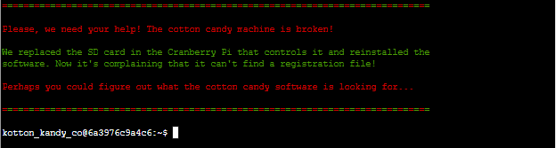
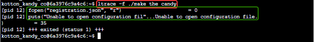
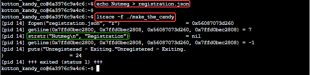
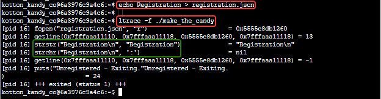
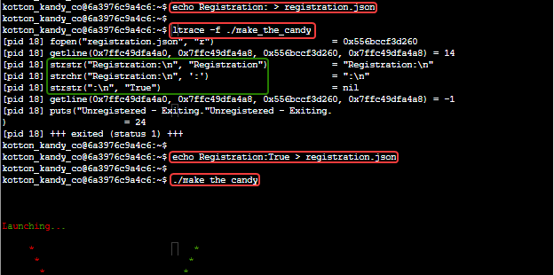

# Strace, Ltrace, Retrace Terminal Challenge

## Elf Introduction

??? quote "Help Tinsel Upatree in the Kitchen"
    Hiya hiya, I'm Tinsel Upatree!<br>
    Say, do you know what's going on next door?<br>
    I'm a bit worried about the whole FrostFest event.<br>
    It feels a bit... ill-conceived, somehow. Nasty even.<br>
    Well, regardless – and more to the point, what do you know about tracing processes in Linux?<br>
    We rebuilt this here Cranberry Pi that runs the cotton candy machine, but we seem to be missing a file.<br>
    Do you think you can use strace or ltrace to help us rebuild the missing config?<br>
    We'd like to help some of our favorite children enjoy the sweet spun goodness again!<br>
    And, if you help me with this, I’ll give you some hints about using Wireshark filters to look for unusual options that might help you achieve Objectives here at the North Pole.

## Hints and Other Resources

??? hint "Other Resources"
    **How to use strace and ltrace commands in Linux**<br>
    <a href="https://www.thegeekdiary.com/how-to-use-strace-and-ltrace-commands-in-linux/">https://www.thegeekdiary.com/how-to-use-strace-and-ltrace-commands-in-linux/</a>

## Open the Terminal

Open the Strace, Ltrace, Retrace terminal in the Kitchen
??? note "Screenshot"
    

## Solution

We start by looking at the files available, and find that there is a single executable file named 'make_the_candy'.  Running this file gives us an message that it cannot open the configuration file.
??? note "Screenshot"
    
    

Both the `strace` and `ltrace` commands can be used to debug the execution of a program.  Both commands have their own particular uses, but for this objective we can use `ltrace` exclusively.

First, run the program while tracing it's execution<br>
```
ltrace -f ./make_the_candy
```
??? note "Screenshot"
    

The output tells us that the program is trying to open the file `registration.json`.  So, let's create a file with that name containing some random content and run the command again.
```
echo Nutmeg > registration.json
ltrace -f ./make_the_candy
```
??? note "Screenshot"
    

Now we see that the program has opened and read 'registration.json', and is next using the <a href="https://www.cplusplus.com/reference/cstring/strstr/">strstr</a> function to match the contents against the string 'Registration'.  So, we will make that the content of the file and try again.
```
echo Registration > registration.json
ltrace -f ./make_the_candy
```
??? note "Screenshot"
    

Now we see that it is using the <a href="https://www.cplusplus.com/reference/cstring/strchr/">strchr</a> function to find the ':' character following 'Registration'.  Repeating this process we determine that the string the program is looking for in the registration file is 'Registration:True'.
??? note "Screenshot"
    
    


## Completion

??? quote "Talk to Tinsel after getting the candy machine working to receieve hints for <a href="../../objectives/O11_Customer_Complaint_Analysis/">Objective 11) Customer Complaint Analysis</a>"
    I'm sure I can put those skills I just learned from you to good use.<br>
    Are you familiar with <a href="https://datatracker.ietf.org/doc/html/rfc3514">RFC3514?</a><br>
    <a href="https://www.wireshark.org/">Wireshark</a> uses a different name for the Evil Bit: ip.flags.rb.<br>
    HTTP responses are often gzip compressed. Fortunately, Wireshark decompresses them for us automatically.<br>
    You can search for strings in Wireshark fields using <a href="https://wiki.wireshark.org/DisplayFilters">display filters</a> with the contains keyword.
