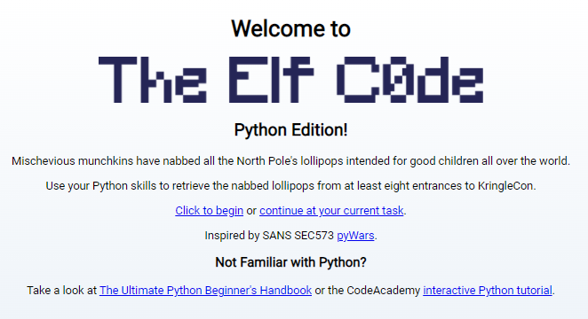

# Elf Code Python Terminal Challenge

## Elf Introduction

??? quote "Help Rib Bonbowford in the Dining Room"
    Hello, I'm Ribb Bonbowford. Nice to meet you!<br>
    Are you new to programming? It's a handy skill for anyone in cyber security.<br>
    This here machine lets you control an Elf using Python 3. It’s pretty fun, but I’m having trouble getting beyond Level 8.<br>
    Tell you what… if you help me get past Level 8, I’ll share some of my SQLi tips with you. You may find them handy sometime around the North Pole this season.<br>
    Most of the information you'll need is provided during the game, but I'll give you a few more pointers, if you want them.<br>
    Not sure what a lever requires? Click it in the Current Level Objectives panel.<br>
    You can move the elf with commands like `elf.moveLeft(5)`, `elf.moveTo({"x":2,"y":2})`, or `elf.moveTo(lever0.position)`.<br>
    Looping through long movements? Don't be afraid to moveUp(99) or whatever. You elf will stop at any obstacle.<br>
    You can call functions like `myFunction()`. If you ever need to pass a function to a munchkin, you can use `myFunction` without the `()`.

## Hints and Other Resources

??? hint "Hints from talking with Rib"
    **Lever Requirements**<br>
    Not sure what a lever requires? Click it in the `Current Level Objectives` panel.<br>
    <br>
    **Moving the Elf**<br>
    You can move the elf with commands like `elf.moveLeft(5)`, `elf.moveTo({"x":2,"y":2})`, or `elf.moveTo(lever0.position)`.<br>
    <br>
    **Bumping into Walls**<br>
    Looping through long movements? Don't be afraid to `moveUp(99)` or whatever. You elf will stop at any obstacle.<br>
    <br>
    **Function Calls**<br>
    You can call functions like `myFunction()`. If you ever need to pass a function to a munchkin, you can use `myFunction` without the `()`.<br>

??? hint "Other Resources"
    **The Ultimate Python Beginners's Handbook**<br>
    <a href="https://www.freecodecamp.org/news/the-python-guide-for-beginners/">https://www.freecodecamp.org/news/the-python-guide-for-beginners/</a>

## Open the Terminal

Open the Elf Code Python game in the Dining Room
??? info "Screenshot"
    

## Solution

For this challenge you must write Python code for each level to guide the elf to his objective. 

### Level 1 - Get Moving

Move the elf to collect the lollipops and get to the KringleCon entrance at dict location {"x":2,"y":2}<br>
Use no more than 8 lines of code and 6 object function calls.

``` python linenums="1"
import elf, munchkins, levers, lollipops, yeeters, pits
lollipop0 = lollipops.get(0)
exit = {"x": 2, "y":2}
elf.moveTo(lollipop0.position)
elf.moveTo(exit)
```

### Level 2 - Get moveTo'ing

Move the elf to collect the lollipops and get to the KringleCon entrance.<br>
Use no more than 10 lines of code and 6 object function calls.


``` python linenums="1"
import elf, munchkins, levers, lollipops, yeeters, pits
lollipop0 = lollipops.get(0)
lollipop1 = lollipops.get(1)
exit = {"x":2, "y":2}
elf.moveTo(lollipop1.position)
elf.moveTo(lollipop0.position)
elf.moveTo(exit)
```


### Level 3 - Don't Get Yeeted!

Move the elf to collect the lollipops and get to the KringleCon entrance.<br>
Use no more than 10 lines of code and 6 object function calls.

``` python linenums="1"
import elf, munchkins, levers, lollipops, yeeters, pits
lever0 = levers.get(0)
lever0_answer = lever0.data() + 2
lollipop0 = lollipops.get(0)
exit = {"x":2, "y":2}
elf.moveTo(levers.get(0).position)
lever0.pull(lever0_answer)
elf.moveTo(lollipop0.position)
elf.moveTo(exit)
```


### Level 4 - Data Types

Pull ALL of the levers by submitting the requested data for each using lever.pull(data) to disable the Yeeter trap at the KringleCon entrance.<br>
Use no more than 18 lines of code and 15 object function calls.

``` python linenums="1"
import elf, munchkins, levers, lollipops, yeeters, pits
lever0, lever1, lever2, lever3, lever4 = levers.get()
exit = {"x":2, "y":2}
elf.moveTo(lever4.position)
lever4.pull("A String")
elf.moveTo(lever3.position)
lever3.pull(True)
elf.moveTo(lever2.position)
lever2.pull(3.14)
elf.moveTo(lever1.position)
lever1.pull(("obj1","obj2"))
elf.moveTo(lever0.position)
lever0.pull({"a":1, "b":2})
elf.moveTo(exit)
```

### Level 5 - Conversions and Comparisons

Pull all of the levers by submitting the requested data for each using lever.pull(data) to disable the Yeeter trap at the KringleCon entrance.<br>
Use no more than 23 lines of code and 18 object function calls.

``` python linenums="1"
import elf, munchkins, levers, lollipops, yeeters, pits
lever0, lever1, lever2, lever3, lever4 = levers.get()
exit = {"x":2, "y":2}
lever4_answer = lever4.data() + " concatenate"
elf.moveTo(lever4.position)
lever4.pull(lever4_answer)
lever3_answer = not(lever3.data())
elf.moveTo(lever3.position)
lever3.pull(lever3_answer)
lever2_answer = int(lever2.data()) + 1
elf.moveTo(lever2.position)
lever2.pull(lever2_answer)
lever1_data = lever1.data()
lever1_data.append(1)
elf.moveTo(lever1.position)
lever1.pull(lever1_data)
lever0_data = lever0.data()
lever0_data["strkey"] = "strvalue"
elf.moveTo(lever0.position)
lever0.pull(lever0_data)
elf.moveTo(exit)
```

### Level 6 - Types and Conditionals

Move the elf to the lever. Get the lever data lever.data() and perform the appropriate action to the data. Submit the modified data using lever.pull(modified_data).<br>
Use no more than 23 lines of code and 6 object function calls.

``` python linenums="1"
import elf, munchkins, levers, lollipops, yeeters, pits
lever = levers.get(0)
data = lever.data()
exit = {"x":2, "y":2}
if type(data) == bool:
    answer = not data
elif type(data) == int:
    answer = data * 2 
elif type(data) == list:
    answer = []
    for i in data:
        answer.append(i+1)
elif type(data) == str:
    answer = data + data
elif type(data) == dict:
    answer = {}
    answer["a"] = data["a"] + 1
elf.moveTo(lever.position)
lever.pull(answer)
elf.moveTo(exit)
```


### Level 7 - Up Down Loopiness

Navigate through the obstacles and collect the lollipop before arriving at the KringleCon entrance.<br>
Use no more than 12 lines of code and 12 object function calls.

``` python linenums="1"
import elf, munchkins, levers, lollipops, yeeters, pits
lollipop = lollipops.get(0)
exit = {"x":2, "y":2}
for num in range(2):
    elf.moveLeft(2)
    elf.moveUp(11)
    elf.moveLeft(2)
    elf.moveDown(11)
elf.moveTo(lollipop.position)
elf.moveTo(exit)
```

### Level 8 - Two Paths, Your Choice

Navigate past the obstacles and avoid the munchkin watching the KringleCon entrance.<br>
Use no more than 12 lines of code and 10 object function calls.

=== "Lever Path"

    ``` python linenums="1"
    import elf, munchkins, levers, lollipops, yeeters, pits
    lever = levers.get(0)
    lever_question = lever.data()
    lever_answer = ['munchkins rule'] + lever_question
    exit = {"x":2, "y":2}
    all_lollipops = lollipops.get()
    for lollipop in all_lollipops:
        elf.moveTo(lollipop.position)
    elf.moveTo(lever.position)
    lever.pull(lever_answer)
    elf.moveDown(3)
    elf.moveTo(exit)
    ```

=== "Munchkin Path"

    ``` python linenums="1"
    import elf, munchkins, levers, lollipops, yeeters, pits
    exit = {"x":2, "y":2}
    munchkin = munchkins.get(0)
    question = munchkin.ask()
    for key in question:
        if question[key] == 'lollipop':
            munchkin.answer(key)
    all_lollipops = lollipops.get()
    for lollipop in all_lollipops:
        elf.moveTo(lollipop.position)
    elf.moveTo(exit)
    ```

## Completion

??? quote "Talk to Rib to receive hints for <a href="../../objectives/O12_Frost_Tower_Website_Checkup/">Objective 12) Frost Tower Website Checkup</a>"   
    Gosh, with skills like that, I'll bet you could help figure out what's really going on next door...<br>
    And, as I promised, let me tell you what I know about SQL injection.<br>
    I hear that having source code for vulnerability discovery dramatically changes the vulnerability discovery process.<br>
    I imagine it changes how you approach an assessment too.<br>
    When you have the source code, API documentation becomes <a href="https://www.npmjs.com/package/express-session">tremendously</a> <a href="https://github.com/mysqljs/mysql">valuable</a>.<br>
    Who knows? Maybe you'll even find more than one vulnerability in the code.


### Bonus Level 9 - Yeeter Swirl

Follow the swirl being careful not to step on any traps (or get yeeted off the map). Note: The elf.moveTo(object) function has been disabled for this challenge.<br>
Use no more than 27 lines of code and 25 object function calls.

``` python linenums="1"
import elf, munchkins, levers, lollipops, yeeters, pits
def func_to_pass_to_munchkin(list_of_lists):
    total = 0
    for list in list_of_lists:
        for element in list:
            if type(element) == int:
                total = total + element
    return total
munchkin = munchkins.get(0)
all_levers = levers.get()
moves = [elf.moveDown, elf.moveLeft, elf.moveUp, elf.moveRight] * 2
for i, move in enumerate(moves):
    move(i+1)
    if i < len(all_levers):
        all_levers[i].pull(i)
elf.moveUp(2)
elf.moveLeft(4)
munchkin.answer(func_to_pass_to_munchkin)
elf.moveUp(1)
```

### Bonus Level 10 - Munchkin Dodging Finale

Dodge the munchkins to get to the KringleCon entrance.<br>
Use no more than 17 lines of code and 15 object function calls.

``` python linenums="1"
import elf, munchkins, levers, lollipops, yeeters, pits
import time
muns = munchkins.get()
lols = lollipops.get()[::-1]
exit = {"x":2, "y":2}
for index, mun in enumerate(muns):
    while (abs(elf.position["x"] - muns[index].position["x"])) < 6:
           time.sleep(0.05)
    elf.moveTo(lols[index].position)
elf.moveTo(exit)
```