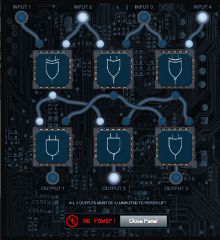
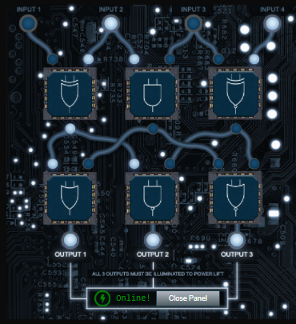

# Frostavator Terminal Challenge

## Troll Introduction

??? quote "Help Grody Goiterson in the Frost Tower Lobby"
    Hrmph. Snrack! Pthbthbthb. 
    Gnerphk. Well, on to business. 
    I'm Grody Goiterson. ... It's a family name. 
    So hey, this is the Frostavator. It runs on some logic chips... that fell out. 
    I put them back in, but I must have mixed them up, because it isn't working now. 
    If you don't know much about logic gates, it's something you should look up. 
    If you help me run the elevator, maybe I can help you with something else. 
    I'm pretty good with FPGAs, if that's worth something to ya'.

## Hints and Other Resources

??? hint "Hints from talking with Grody"
    **Logic Gate Iconography** 
    <a href="https://www.geeksforgeeks.org/introduction-of-logic-gates/">This</a>

## Open the Terminal

Open the Frostavator panel in the Frost Tower Lobby
??? info "Screenshot"
    

## Solution

To complete this challenge we have to rearrange the logic gates as shown to provide power to all 3 outputs.

## Completion

??? quote "Talk to Grody after getting the Frostavator running to receive hints for <a href="../../objectives/O13_FPGA_Programming/">Objective 13) FPGA Programming</a>"   
    Oooo... That's it! 
    A deal's a deal. Let's talk FPGA. 
    First, did you know there are people who do this stuff <a href="https://www.fpga4fun.com/MusicBox.html">for fun</a>? 
    I mean, I'm more into picking on other trolls for fun, but whatever. 
    Also, that Prof. Petabyte guy is giving <a href="https://www.youtube.com/watch?v=GFdG1PJ4QjA">a talk</a> about FPGAs. Weirdo. 
    So hey, good luck or whatever.

