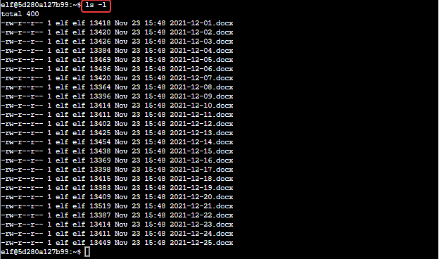
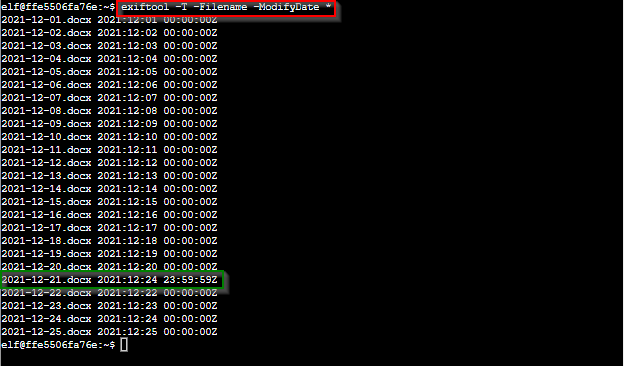

# Document Analysis / Exif Metadata Terminal Challenge

## Elf Introduction

??? quote "Help Pinny Sappington in the Courtyard"
    Hi ho, Piney Sappington at your service! 
    Well, honestly, I could use a touch of your services. 
    You see, I've been looking at these documents, and I know someone has tampered with one file. 
    Do you think you could log into this Cranberry Pi and take a look? 
    It has exiftool installed on it, if that helps you at all. 
    I just... Well, I have a feeling that someone at that other conference might have fiddled with things. 
    And, if you help me figure this tampering issue out, I’ll give you some hints about OSINT, especially associated with geographic locations!

## Hints and Other Resources

??? hint "Other Resources"
    <a href="https://exiftool.org/">ExifTool main page</a> 
    <a href="https://exiftool.org/exiftool_pod.html">ExifTool command reference</a> 

## Open the Terminal

Open the Exif Metadata terminal in the Courtyard
??? info "Screenshot"
    

## Solution

Logging into the terminal we are told that we must determine the naughty/nice record file that Jack modified just before Christmas.

The most obvious way to do this would be to use the `ls -l` command to give us a list of all files and the date/time that they were last modified.  However, in this case we find that does not provide us the information that we are looking for.
??? info "Screenshot"
    

Pinny and the terminal introduction mention that exiftool is installed.  While exiftool is most commonly associated with picture and image files, it can read metadata from other file formats, including .docx.

To have exiftool display the metadata filename and last modified date for all files, use the command `exifdata -T -Filename -ModifyDate *`, which tells us the file that was modified on 2021-12-24.
??? info "Screenshot"
    

!!! success "Answer"
    2021-12-21.docx

## Completion

??? quote "Talk to Pinney to receive hints for <a href="../../objectives/O2_Where_in_the_World_is_Caramel_Santaigo/">Objective 2) Where in the World is Caramel Santaigo</a>"   
    Wow, you figured that out in no time! Thanks! 
    I knew they were up to no good. 
    So hey, have you tried the Caramel Santaigo game in this courtyard? 
    Carmen? No, I haven't heard of her. 
    So anyway, some of the hints use obscure coordinate systems like <a href="https://en.wikipedia.org/wiki/Military_Grid_Reference_System">MGRS</a> and even <a href="https://what3words.com/">what3words</a>. 
    In some cases, you might get an image with location info in the metadata. Good thing you know how to see that stuff now! 
    (And they say, for those who don't like gameplay, there might be a way to bypass by looking at some flavor of cookie...) 
    And Clay Moody is giving a talk on OSINT techniques right now! 
    Oh, and don't forget to learn about your target elf and filter in the Interrink system!
