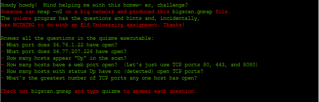
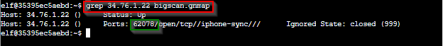
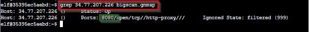
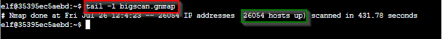
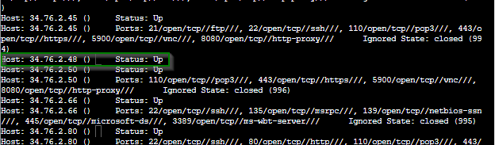
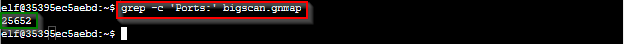
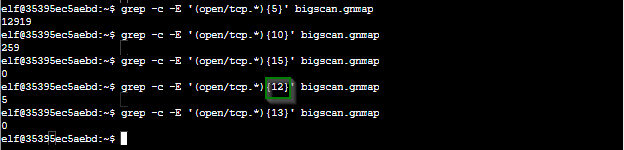

# Grepping for Gold Terminal Challenge

## Troll Introduction

??? quote "Help Greasy GopherGuts in front of the Frost Tower"
    Grnph. Blach! Phlegm.<br>
    I'm Greasy Gopherguts. I need help with parsing some Nmap output.<br>
    If you help me find some results, I'll give you some hints about Wi-Fi.<br>
    Click on the terminal next to me and read the instructions.<br>
    Maybe search for a cheat sheet if the hints in the terminal don't do it for ya'.<br>
    You’ll type `quizme` in the terminal and `grep` through the Nmap bigscan.gnmap file to find answers.<br>


## Hints and Other Resources

??? hint "Hints from talking with Greasy"
    **Grep Cheat Sheet**<br>
    Check <a href="https://ryanstutorials.net/linuxtutorial/cheatsheetgrep.php">this</a> out if you need a `grep` refresher.

??? hint "Other Resources"
    **Nmap Options Summary**<br>
    <a href="https://nmap.org/book/man-briefoptions.html">https://nmap.org/book/man-briefoptions.html</a><br>

    **Regular Expression Tester**<br>
    <a href="https://regex101.com/">https://regex101.com/</a>


## Open the Terminal

Open the Grepping for Gold terminal in front of Frost Tower<br>
??? info "Screenshot"
    


## Solution

### Question 1: What port does 34.76.1.22 have open?

nmap output includes the ports that a particular host has open, so we just need to issue a grep command with the IP address as the pattern and see what is in the output.<br>
```
grep 34.76.1.22 bigscan.gnmap
```

??? info "Screenshot"
    

!!! success "What port does 34.76.1.22 have open?"
    62078

### Question 2: What port does 34.77.207.226 have open?

Use the same command from the previous question with a different IP address<br>
``` 
grep 34.77.207.226 bigscan.gnmap
```

??? info "Screenshot"
    

!!! success "What port does 34.77.207.226 have open?"
    8080

### Question 3: How many hosts appear "Up" in the scan?

Nmap scans identify a host that is 'Up' with the 'Status: Up' value, so we need to count how many times that pattern appears in the scan.  This can be done in several ways. 

=== "Option 1" 
    Use the native grep command option `-c` to return a count of how many times the pattern appears in the log<br> 
    ```
    grep -c 'Status: Up' bigscan.gnmap
    ```

    ??? info "Screenshot"
        

=== "Option 2"
    Using grep, return all the lines with the pattern and then pipe that into `wc` (word count) with the `-l` switch which will return the number of lines.<br>
    ```
    grep 'Status: Up' bigscan.gnmap | wc -l
    ```
    
    ??? info "Screenshot"
        

=== "Option 3"
    Don't bother with `grep` at all.  Rather, output the last line of the nmap file which helpfully provides a summary of how many IPs were scanned and how many were found to be up.<br>
    ```
    tail -l bigscan.gnmap
    ```
    ??? info "Screenshot"
        

!!! success "How many hosts appear 'Up' in the scan?"
    26054

### Question 4: How many hosts have a web port open? (TCP 80, 443, and 8080)

From the output of the last two commands we see that if nmap finds a port to be open it is included in the output as `<portnumber>/open/<protocol>/<service name>`.  If more than one port is open then nmap will output all ports on a single line.

To search for lines containing more than one possible pattern we can use the `-E` switch to specify the pattern as an extended regular expression, using each of the possible matching patterns with the OR operator.<br>

=== "Option 1"

    ```
    grep -c -E '80/open/tcp|8080/open/tcp|443/open/tcp' bigscan.gnmap
    ```

    ??? info "Screenshot"
        

=== "Option 2"

    ```
    grep -E '(80|443|8080)/open/tcp' bigscan.gnmap | wc -l
    ```

    ??? info "Screenshot"
        

!!! success "How many hosts have a web port open? (TCP 80, 443, and 8080)"
    14372

### Question 5: How many hosts with a status "Up" have no (dedicated) open TCP ports?

If a host is up but has no ports open, then it will be in the output with no 'Ports' line.

??? info "Screenshot"
    

From a previous command we know that there are 26054 hosts that are up, so we just need to subtract from that the number that have open ports.<br>

```
grep -c 'Ports:' bigscan.gnmap
```

??? info "Screenshot"
    

25652 hosts have open ports so the number that do not is `26054 - 25652 = 402`

!!! success "How many hosts with status Up have no (dedicated) open TCP ports?"
    402


### Question 6: What's the greatest number of TCP ports any one host has open?

A host with multiple TCP ports open will have the pattern 'open/tcp' repeated in the output for each open port.  Using the regular expression qualifier `{#}` we can specify that we want to match a pattern exactly # times.  So using this command with a variety of values for # we can zero in on the largest value that returns results.<br>

```
grep -c -E '(open/tcp.*){#}' bigscan.gnmap
```

??? info "Screenshot"
    

!!! success "What's the greatest number of TCP ports any one host has open?"
    12


## Completion

??? quote "Talk to Greasy to receive hints for <a href="../../objectives/O3_Thaw_Frost_Towers_Entrance/">Objective 3) Thaw Frost Tower's Entrance</a>"   
    Grack. Ungh. ... Oh!<br>
    You really did it?<br>
    Well, OK then. Here's what I know about the wifi here.<br>
    Scanning for Wi-Fi networks with iwlist will be location-dependent. You may need to move around the North Pole and keep scanning to identify a Wi-Fi network.<br>
    Wireless in Linux is supported by many tools, but iwlist and iwconfig are commonly used at the command line.<br>
    The curl utility can make HTTP requests at the command line!<br>
    By default, curl makes an HTTP GET request. You can add --request POST as a command line argument to make an HTTP POST request.<br>
    When sending HTTP POST, add --data-binary followed by the data you want to send as the POST body.<br>

