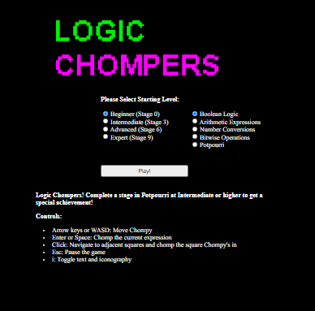

# Logic Munchers Terminal Challenge

## Elf Introduction

??? quote "Help Noel Boetie in front of Santa's Castle"
    Hello there! Noel Boetie here. We’re all so glad to have you attend KringleCon IV and work on the Holiday Hack Challenge! 
    I'm just hanging out here by the Logic Munchers game. 
    You know… logic: that thing that seems to be in short supply at the tower on the other side of the North Pole? 
    Oh, I'm sorry. That wasn't terribly kind, but those frosty souls do confuse me... 
    Anyway, I’m working my way through this Logic Munchers game. 
    A lot of it comes down to understanding boolean logic, like `True And False` is `False`, but `True And True` is `True`. 
    It *can* get a tad complex in the later levels. 
    I need some help, though. If you can show me how to complete a stage in Potpourri at the Intermediate (Stage 3) or higher, I’ll give you some hints for how to find vulnerabilities. 
    Specifically, I’ll give you some tips in finding flaws in some of the web applications I’ve heard about here at the North Pole, especially those associated with slot machines! 

## Hints and Other Resources

??? hint "Hints from talking with Noel"
    **Boolean Logic** 
    There are lots of special symbols for logic and set notation. <a href="http://notes.imt-decal.org/sets/cheat-sheet.html">This one</a> covers AND, NOT, and OR at the bottom.

    **AND, OR, NOT, XOR** 
    <a href="http://www.natna.info/English/Teaching/CSI30-materials/Chapter1-cheat-sheet.pdf">This</a> might be a handy reference too.

## Open the Terminal

Open the Logic Munchers terminal in front of Santa's Castle
??? info "Screenshot"
    

## Solution

While I expect there are ways to hack the game in order to win, I found solving the semi-complex logic puzzles equally challenging and in my opinion relevant to the 'hacker' mindset, so my solution to this challenge was to simply play the game as intended.

But there is an important strategy to use, especially at the higher levels, which is to pause the game periodically with the ++esc++ key in order to give yourself time to solve several of the nearby squares.  Then unpause, clear as many as you can, and repeat without getting eaten by a Trollog until there are no true values left.

And remember that as a Trollog passes over a square the logic puzzle under it will change.

It is also helpful to take note of the hints provided at the various levels, which are compiled in <a href="../../extras/T4_Logic_Munchers">this table</a> in the Extras section.

## Completion

??? quote "Talk to Noel after completing an Intermediate - Potpourri level to receive hints for <a href="../../objectives/O4_Slot_Machine_Investigation/">Objective 4) Slot Machine Investigation</a>"   
    Wow - amazing score! Great work! 
    So hey, those slot machines. It seems that in his haste, Jack bought some terrible hardware. 
    It seems they're susceptible to <a href="https://owasp.org/www-community/attacks/Web_Parameter_Tampering">parameter tampering</a>. 
    You can modify web request parameters with an intercepting proxy or tools built into Firefox.
