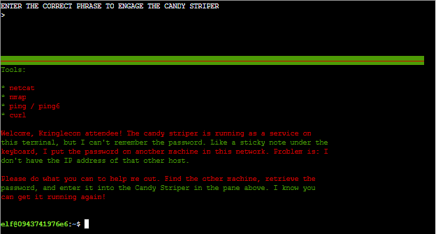
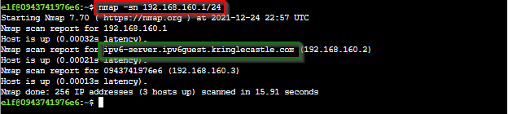
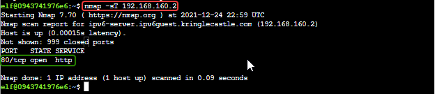
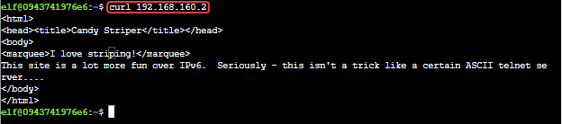
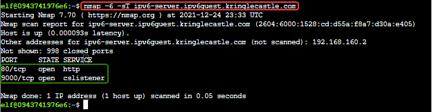
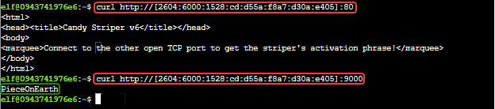

# IPv6 Sandbox Terminal Challenge

## Elf Introduction

??? quote "Help Jewel Loggins in KringleCon Talks Lobby"
    Well hello! I'm Jewel Loggins.<br>
    I have to say though, I'm a bit distressed.<br>
    The con next door? Oh sure, I’m concerned about that too, but I was talking about the issues I’m having with IPv6.<br>
    I mean, I know it's an old protocol now, but I've just never checked it out.<br>
    So now I'm trying to do simple things like Nmap and cURL using IPv6, and I can't quite get them working!<br>
    Would you mind taking a look for me on this terminal?<br>
    I think there's a <a href="https://gist.github.com/chriselgee/c1c69756e527f649d0a95b6f20337c2f">Github Gist</a> that covers tool usage with IPv6 targets.<br>
    The tricky parts are knowing when to use [] around IPv6 addresses and where to specify the source interface.<br>
    I’ve got a deal for you. If you show me how to solve this terminal, I’ll provide you with some nice tips about a topic I’ve been researching a lot lately – Ducky Scripts! They can be really interesting and fun!<br>

## Hints and Other Resources

??? hint "Hints from talking with Jewel"
    **IPv6 Reference**<br>
    Check out <a href="https://gist.github.com/chriselgee/c1c69756e527f649d0a95b6f20337c2f">this Github Gist</a> with common tools used in an IPv6 context.

??? hint "Other Resources"
    **IPv6 Address format**<br>
    <a href="https://en.wikipedia.org/wiki/IPv6_address">https://en.wikipedia.org/wiki/IPv6_address</a>


## Terminal Introduction

Open the IPv6 Sandbox terminal in the KringleCon Talk Lobby
??? info "Screenshot"
    

## Solution

For this challenge we need to find another machine in the network that we can get the Candy Striper password from.

Using the command `ifconfig` we learn that our IP address is 192.168.160.3, so let's start with a simple scan of our local class C network with nmap to see what is there.<br>
```
nmap -sn 192.168.160.1/24
```
??? info "Screenshot"
    

From this we see that there is a server named `ipv6-server.ipv6guest.kringlecastle.com` with the IPv4 address 192.168.160.2.  Let's see what ports are open on it.<br>
```
map -sT 192.168.160.2
```
??? info "Screenshot"
    

Port 80 is open, so let's see what we get when we connect.<br>
```
curl 192.168.160.2
```
??? info "Screenshot"
    

Unsurprisingly, given the description of this challenge, there is nothing interesting on the IPv4 port.  So, let's see what IPv6 ports are open.<br>
```
nmap -6 -sT ipv6-server.ipv6guest.kringlecastle.com
```
??? info "Screenshot"
    

Now we see two ports, 80 and 9000 are open.  Using cURL with both of these ports we find the answer we are looking for on port 9000.<br>
```
curl http://[2604:6000:1528:cd:d55a:f8a7:d30a:e405]:80
curl http://[2604:6000:1528:cd:d55a:f8a7:d30a:e405]:9000
```
??? info "Screenshot"
    

!!! success "Answer"
    PieceOnEarth

## Completion

??? quote "Talk to Jewel to receive hints for <a href="../../objectives/O5_Strange_USB_Device/">Objective 5) Strange USB Device</a>"   
    Great work! It seems simpler now that I've seen it once. Thanks for showing me!<br>
    Prof. Petabyte warned us about random USB devices. They might be malicious keystroke injectors!<br>
    A troll could program a keystroke injector to deliver malicious keystrokes when it is plugged in.<br>
    Ducky Script is a language used to specify those keystrokes.<br>
    What commands would a troll try to run on our workstations?<br>
    I heard that SSH keys <a href="https://attack.mitre.org/techniques/T1098/004/">can be used as backdoors</a>. Maybe that's useful?
