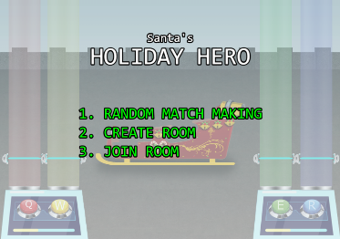
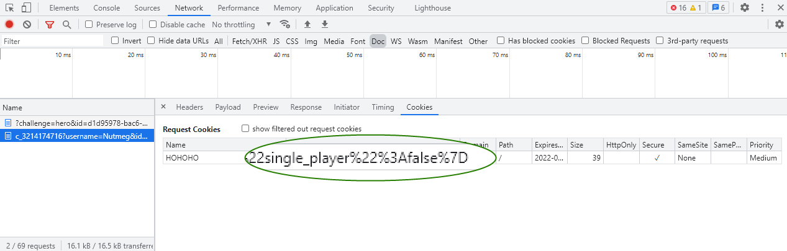
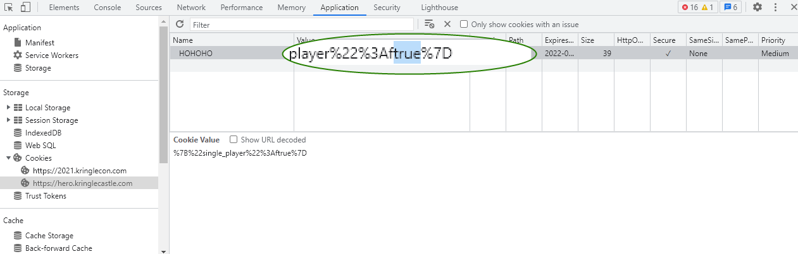
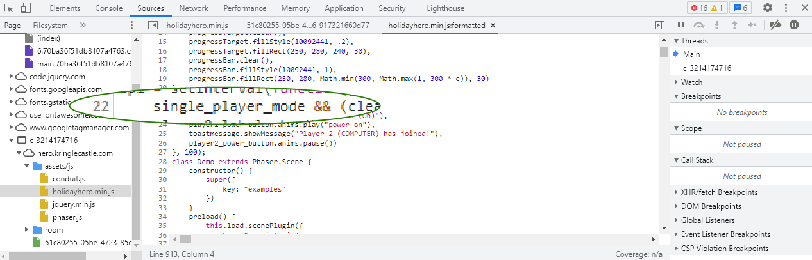
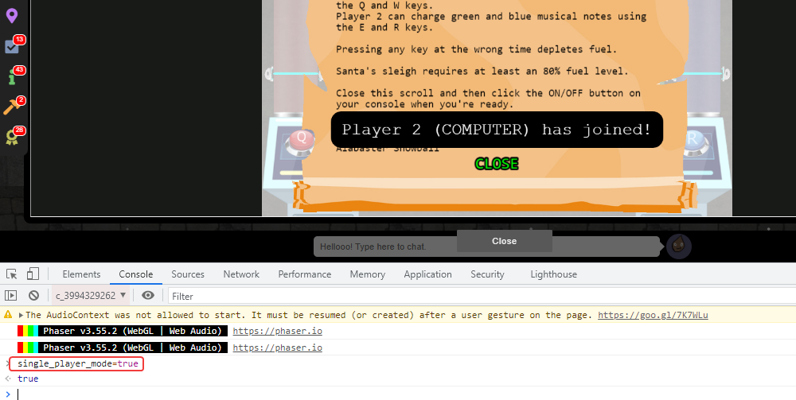
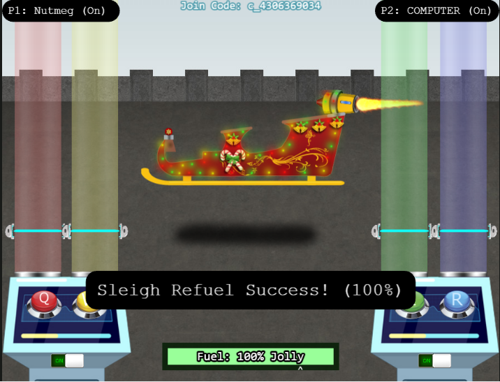

# Holiday Hero Terminal Challenge

## Elf Introduction

??? quote "Help Chimney Scissorsticks in the KringleCon Netwars area"
    Woo! I'm Chimney Scissorsticks, and I'm having a great time up here! 
    I've been hanging out with all these NetWars players and not worrying about what's going on next door. 
    In fact, I've really been having fun playing with this Holiday Hero terminal. You can use it to generate some jamming holiday tunes that help power Santa’s sleigh! 
    It's more fun to play with a friend but I've also heard there's a clever way to enable single player mode. 
    Single player mode? I heard it can be enabled by fiddling with two client-side values, one of which is passed to the server. 
    It's so much more fun and easier with a friend though! 
    Either way, we'd really appreciate your help getting the sleigh all fueled up. 
    Then I can get back to thinking about shellcode.. 

## Hints and Other Resources

??? hint "Other Resources"
    **Chrome Developer Tools** 
    <a href="https://developer.chrome.com/docs/devtools/">https://developer.chrome.com/docs/devtools/</a>

## Open the Terminal

Click on Santa's Sleigh on the roof of Santa's Castle to start the game.
??? info "Screenshot"
    

## Solution

The game can be won by playing it with another player, but where is the sense of accomplishment in that?  So this solution will describe how to force the game to run in single player mode so you don't have to share the glory with anyone else.

Note that these instructions are written for the Chrome web browser.  Other browsers may have slightly different steps but the basics will be the same.  Also note that if you are using a privacy enhancing browser such as Brave, some things might not work exactly as expected (such as the client-side cookie not being saved). 

### Single Player Mode step 1 - Modify the client-side cookie

Open the browser Development Tools (++ctrl+shift+i++, or from 'Menu > More tools > Developer tools') and start a game by selecting 'Create Room'

While at the Welcome screen, open the Network panel in Developer Tools and filter on the type Doc.  There will be an entry for a URL containing the ID of the game just started.  Highlight it and view the 'Cookies' tab on the left.  Here we will find that the HOHOHO cookie has the value single_player set to false.
??? info "Screenshot"
    

To modify this cookie open the Application panel, then drill down into 'Storage > Cookies > https://hero.kringlecastle.com' and edit the value to be true.
??? info "Screenshot"
    

Note that this cookie is stored client side, so unless you clear cookies you shouldn't have to do this again if you start another game.

### Single Player Mode step 2 - Modify the JavaScript variable

The second value we need to change is in the JavaScript.  To find it open the Sources panel, then drill down into '<id> > hero.kringlecastle.com > assets/js > holidayhero.min.js'.  The file is minified so select the option to 'Pretty-print' the file so we can read it.

Viewing the code we see on line 22 that there is a variable named single_player_mode.  
??? info "Screenshot"
    

To set this variable for the running session (this code is retrieved from the server every time the page is loaded), go to the Console panel, set the JavaScript context to the ID of the game, then set 
`single_player_mode = true`

As soon as we do we will get the message that 'Player 2 (COMPUTER) has joined!'
??? info "Screenshot"
    

Now we can start the game and the computer will play flawlessly as your partner.

??? info "Screenshot"
    

## Completion

??? quote "Talk to Chimney after winning the game to receive hints for <a href="../../objectives/O6_Shellcode_Primer/">Objective 6) Shellcode Primer</a>"   
    You did it - rock on! We're all set now that the sleigh is fueled! 
    So hey, let me talk to you a bit about manual exploitation. 
    If you run into any shellcode primers at the North Pole, be sure to read the directions and the comments in the shellcode source! 
    Also, troubleshooting shellcode can be difficult. Use the debugger step-by-step feature to watch values. 
    Lastly, be careful not to overwrite any register values you need to reference later on in your shellcode. 
    That's it! I know you can do it!

