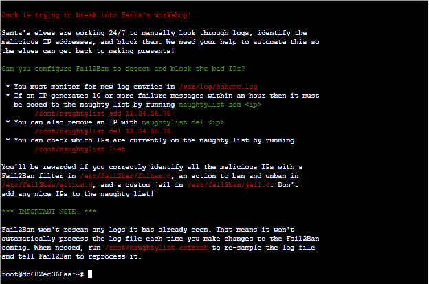
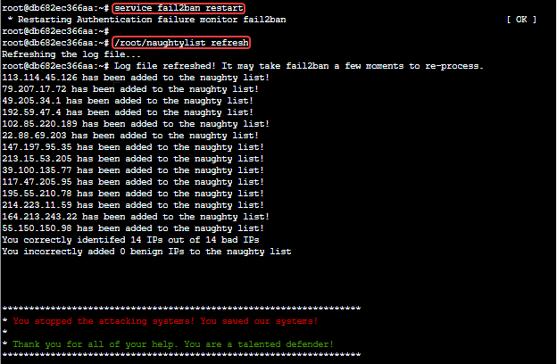

# HoHo ... No Terminal Challenge

## Elf Introduction

??? quote "Help Eve Snowshoes in Santa's Office"
    Hey there, how's it going? I'm Eve Snowshoes.<br>
    Lately I've been spending a lot of cycles worrying about what's going on next door.<br>
    Before that, I was checking out Fail2Ban.<br>
    It's this slick log scanning tool for Apache web servers.<br>
    If you can complete this terminal challenge, I’d be happy to give you some things I’ve learned about Kerberoasting and Active Directory permissions!<br>
    Why don't you do some work with Fail2Ban on this Cranberry Pi terminal first, then we’ll talk Kerberoasting and Active Directory. OK?

## Hints and Other Resources

??? hint "Other Resources"
    **KringleCon Talk**<br>
    <a href="http://www.youtube.com/watch?v=Fwv2-uV6e5I">Automate Security Response by Creating Your Own "Naughty Lists</a> - Andy Smith

    **Fail2ban Jails, Filters, and Actions**<br>
    <a href="https://www.fail2ban.org/wiki/index.php/MANUAL_0_8#General_settings">https://www.fail2ban.org/wiki/index.php/MANUAL_0_8#General_settings</a>


## Open the Terminal

Open the HoHo ... No terminal in Santa's office
??? info "Screenshot"
    

## Solution

To complete this objective we need to create three Fail2ban configuration files, a jail, a filter, and an action.

### Jail Configuration

This file contains the basic configuration of the jail, referencing the filter, action, log to be processed, and criteria to trigger the action (the filter being evaluated as true 10 times every 60 minutes)

``` title="/etc/fail2ban/jail.d/nutmeg-jail.conf"
[nutmeg-jail]
enabled = true
filter = nutmeg-filter
action = nutmeg-action
logpath = /var/log/hohono.log
maxretry = 10
findtime = 60m
```
### Action Configuration

This file contains the necessary actions to ban and unban an IP address as specified in the introduction.<br>

``` title="/etc/fail2ban/action.d/nutmeg-action.conf"
[Definition]
actionban = /root/naughtylist add <ip>
actionunban = /root/naughtylist del <ip>
```

### Filter Configuration

Looking through the '/var/log/hohono.log' file we find that there are 4 types of entries in the fail that represent some kind of failure, which need to be added to the filter configuration file.

``` title="/etc/fail2ban/filter.d/nutmeg-filter.conf"
[Definition]
failregex = Failed login from <HOST>
            Login from <HOST> rejected due to unknown user name
            <HOST> sent a malformed request
            Invalid heartbeat .+ from <HOST>$
```
Note that while the last line in the filter could be written excluding the trailing '$', this character should be included to avoid the potential of malicious input as described in the <a href="https://youtu.be/Fwv2-uV6e5I?t=716">KringleCon Talk</a>

!!! warning
    In the Action and Filter configuration files, "Definition" and "ip" must match the case shown here.

### Processing the log

After creating the three files, restart Fail2ban and refresh the log<br> 
```
service fail2ban restart
/root/naughtylist refresh
```
??? info "Screenshot"
    


## Completion

??? quote "Talk to Eve to receive hints for <a href="../../objectives/O8_Kerberoasting_on_an_Open_Fire/">Objective 8) Kerberoasting on an Open Fire</a>"   
    Fantastic! Thanks for the help!<br>
    Hey, would you like to know more about Kerberoasting and Active Directory permissions abuse?<br>
    There's a great <a href="https://www.youtube.com/watch?v=iMh8FTzepU4">talk</a> by Chris Davis on this exact subject!<br>
    There are also plenty of resources available to learn more about <a href="https://gist.github.com/TarlogicSecurity/2f221924fef8c14a1d8e29f3cb5c5c4a">Kerberoasting</a> specifically.<br>
    If you have any trouble finding a domain controller, remember that, when not running as root, nmap default probing relies on connecting to TCP 80 and 443.<br>
    Got a hash that won't crack with your wordlist? <a href="https://github.com/NotSoSecure/password_cracking_rules">OneRuleToRuleThemAll.rule</a> is a great way to grow your keyspace.<br>
    Where'd you get your wordlist? <a href="https://github.com/digininja/CeWL">CeWL</a> might generate a great wordlist from the ElfU website, but it will ignore digits in terms by default.<br>
    So, apropos of nothing, have you ever known system administrators who store credentials in scripts? I know, I know, you understand the folly and would never do it!<br>
    The easy way to investigate Active Directory misconfigurations (for Blue and Red alike!) is with <a href="https://github.com/BloodHoundAD/BloodHound">Bloodhound</a>, but there are <a href="https://social.technet.microsoft.com/Forums/en-US/df3bfd33-c070-4a9c-be98-c4da6e591a0a/forum-faq-using-powershell-to-assign-permissions-on-active-directory-objects?forum=winserverpowershell">native</a> <a href="https://www.specterops.io/assets/resources/an_ace_up_the_sleeve.pdf">methods</a> as well.<br>
    Oh, and one last thing: once you've granted permissions to your user, it might take up to five minutes for it to propagate throughout the domain.<br>

    
