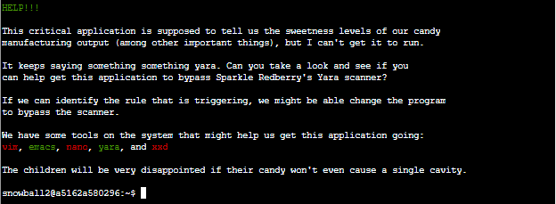
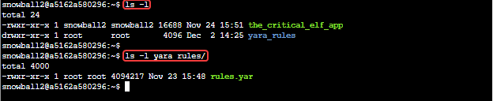
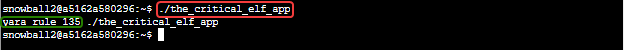
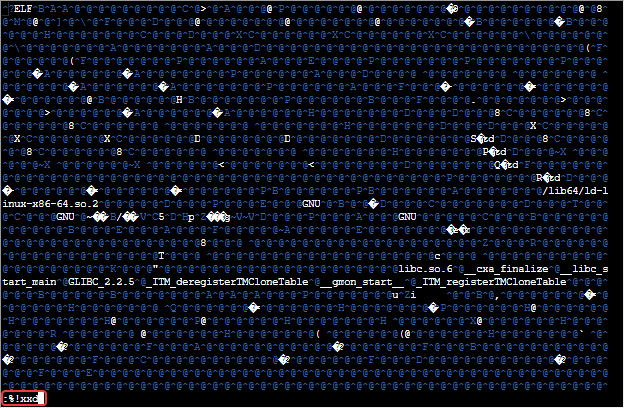
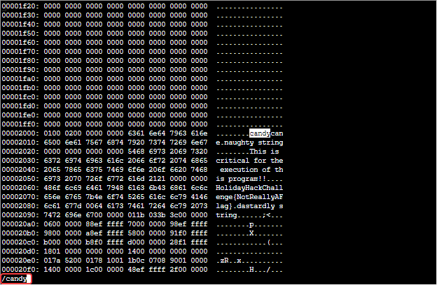
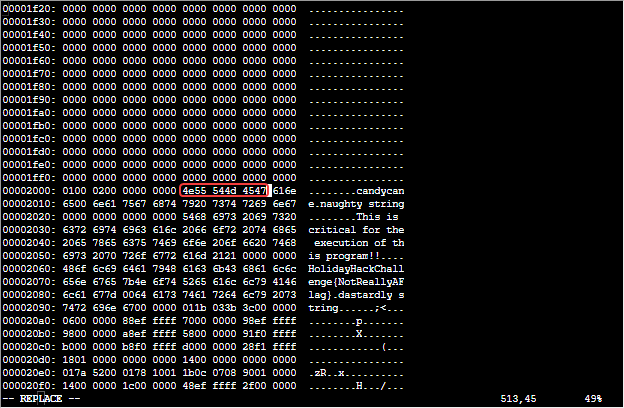
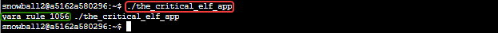
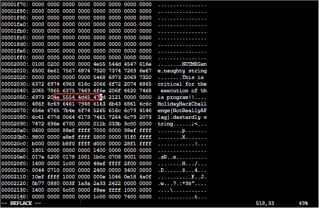
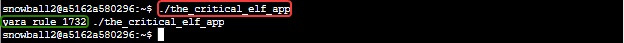
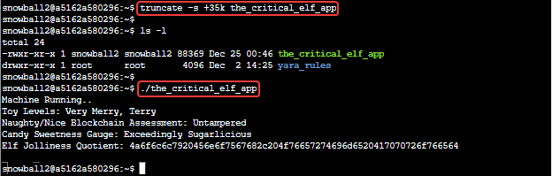

# Yara Analysis Terminal Challenge

## Elf Introduction

??? quote "Help Fitzy Shortstack in the KringleCon Entry"
    Hiya, I'm Fitzy Shortstack!<br>
    I was just trying to learn a bit more about YARA with this here Cranberry Pi terminal.<br>
    I mean, I'm not saying I'm worried about attack threats from that other con next door, but...<br>
    OK. I AM worried. I've been thinking a bit about how malware might bypass YARA rules.<br>
    If you can help me solve the issue in this terminal, I’ll understand YARA so much better! Would you please check it out so I can learn?<br>
    And, I’ll tell you what – if you help me with YARA, I’ll give you some tips for Splunk!<br>
    I think if you make small, innocuous changes to the executable, you can get it to run in spite of the YARA rules.

## Hints and Other Resources

??? hint "Other Resources"
    **Yara Documentation**<br>
    <a href="https://yara.readthedocs.io/en/stable/">https://yara.readthedocs.io/en/stable/</a>

    **Editing binary files with vim**<br>
    <a href="https://transang.me/edit-binary-file-with-vim-and-the-xxd-command/">https://transang.me/edit-binary-file-with-vim-and-the-xxd-command/</a>

## Open the Terminal

Open the Yara Analysis terminal in the KringleCon Entry
??? info "Screenshot"
    

## Solution

Looking at the files after logging in we see that 'the_critical_elf_app' is in our home directory, along with a 'yara_rules' directory containing a 'rules.yara' file.<br>
??? info "Screenshot"
    

### The first Yara rule

Running `./the_critical_elf_app` triggers the first yara rule, #135.
??? info "Screenshot"
    
    
So we edit the file 'yara_rules/rules.yara' and locate rule 135.

``` 
rule yara_rule_135 {
meta:
    description = "binaries - file Sugar_in_the_machinery"
    author = "Sparkle Redberry"
    reference = "North Pole Malware Research Lab"
    date = "1955-04-21"
    hash = "19ecaadb2159b566c39c999b0f860b4d8fc2824eb648e275f57a6dbceaf9b488"
strings:
    $s = "candycane"
condition:
    $s
}
```

The rules file cannot be modified, so instead we need to modify 'the_critical_elf_app' in some way to prevent this rule from evaluating as true.  The condition the rule is looking for the string "candycane".<br>

Editing 'the_critical_elf_app' with `vim` (or any other editor) we see that it is a binary file.  But it is possible to edit binary files with `vim` by using the `xxd` utility.<br>

- Open the file with `vim the_critical_elf_app`
- Convert the binary file to a hex readable format with the vim command `:%!xxd` 
??? info "Screenshot"
    
- Now we can search the file for what we want to change
??? info "Screenshot"
    
- Edit the hex (left) portion of the file.  Note that we are not using an actual hex editor, so the ASCII text on the right of the screen will not change. 
??? info "Screenshot"
    
- Convert the file back to binary with the vim command `:%!xxd -r`, 
- Save and exit using `:wq!`

### The second Yara rule

This time when we run `./the_critical_elf_app`, we trigger Yara rule 1056. 
??? info "Screenshot"
    

```
rule yara_rule_1056 {
   meta:
        description = "binaries - file frosty.exe"
        author = "Sparkle Redberry"
        reference = "North Pole Malware Research Lab"
        date = "1955-04-21"
        hash = "b9b95f671e3d54318b3fd4db1ba3b813325fcef462070da163193d7acb5fcd03"
    strings:
        $s1 = {6c 6962 632e 736f 2e36}
        $hs2 = {726f 6772 616d 2121}
    condition:
        all of them
}
```
This rule is triggering on two hex strings represented by the variables $s1 and $hs2.<br>  
Translating the two strings from hex using <a href="https://gchq.github.io/CyberChef/#recipe=From_Hex('Auto')&input=NmM2OTYyNjMyZTczNmYyZTM2CjIwCjcyNmY2NzcyNjE2ZDIxMjE">Cyber Chef</a> we learn that<br> 

- $s1="libc.so.6"
- $hs2="rogram!!" 

It's likely that modifying the string in the application that refers to the GNU C library will break the application, but as the rule requires that *both* strings are present we can prevent the rule from triggering by changing the other one.<br>

Following the same steps as before we again open the file in vim, convert it from binary using xxd, edit it, convert it back to binary, and save it.
??? info "Screenshot"
    

### The third Yara rule

Again, we run `./the_critical_elf_app` and find that rule #1732 is triggering. 
??? info "Screenshot"
    

```
rule yara_rule_1732 {
   meta:
      description = "binaries - alwayz_winter.exe"
      author = "Santa"
      reference = "North Pole Malware Research Lab"
      date = "1955-04-22"
      hash = "c1e31a539898aab18f483d9e7b3c698ea45799e78bddc919a7dbebb1b40193a8"
   strings:
      $s1 = "This is critical for the execution of this program!!" fullword ascii
      $s2 = "__frame_dummy_init_array_entry" fullword ascii
      $s3 = ".note.gnu.property" fullword ascii
      $s4 = ".eh_frame_hdr" fullword ascii
      $s5 = "__FRAME_END__" fullword ascii
      $s6 = "__GNU_EH_FRAME_HDR" fullword ascii
      $s7 = "frame_dummy" fullword ascii
      $s8 = ".note.gnu.build-id" fullword ascii
      $s9 = "completed.8060" fullword ascii
      $s10 = "_IO_stdin_used" fullword ascii
      $s11 = ".note.ABI-tag" fullword ascii
      $s12 = "naughty string" fullword ascii
      $s13 = "dastardly string" fullword ascii
      $s14 = "__do_global_dtors_aux_fini_array_entry" fullword ascii
      $s15 = "__libc_start_main@@GLIBC_2.2.5" fullword ascii
      $s16 = "GLIBC_2.2.5" fullword ascii
      $s17 = "its_a_holly_jolly_variable" fullword ascii
      $s18 = "__cxa_finalize" fullword ascii
      $s19 = "HolidayHackChallenge{NotReallyAFlag}" fullword ascii
      $s20 = "__libc_csu_init" fullword ascii
   condition:
      uint32(1) == 0x02464c45 and filesize < 50KB and
      10 of them
}
```
This is a more complicated rule.  The condition consists of 3 parts

- The first condition matches if there is a 32 bit unsigned integer, in little-endian format, at position 1 of the file matching the hex value 0x02464c45.  This is the first set of bytes that occur in an <a href="https://en.wikipedia.org/wiki/Executable_and_Linkable_Format">ELF</a> (Executable and Linkable Format) file, so we have no option to change this.
- The second condition is a requirement that the file be less than 50KB in size.
- The third condition is that 10 of the 20 defined strings are found in the file.

Looking through the strings it *might* be possible to edit the binary as we did before to remove 11 of the 20 strings specified, but there is an easier way.<br>

ELF binary files can have NULL characters appended to the end of them without affecting their execution.  As we saw when we first inspected the files on the system, 'the_critical_elf_app' is 16,689 bytes in length.  We can extend the file by 35KB with the truncate command. 
```
truncate -s +35k the_critical_elf_app
```

Now that the file is larger than 50k in size it will run.
??? info "Screenshot"
    


## Completion

??? quote "Talk to Fitzy after getting the application to run to receive hints for <a href="../../objectives/O9_Splunk/">Objective 9) Splunk!</a>"   
    Thanks - you figured it out!<br>
    Let me tell you what I know about Splunk.<br>
    Did you know Splunk recently added support for new data sources including Sysmon for Linux and GitHub Audit Log data?<br>
    Between GitHub audit log and webhook event recording, you can monitor all activity in a repository, including common git commands such as git add, git status, and git commit.<br>
    You can also see cloned GitHub projects. There's a lot of interesting stuff out there. Did you know there are repositories of code that are Darn Vulnerable?<br>
    Sysmon provides a lot of valuable data, but sometimes correlation across data types is still necessary.<br>
    Sysmon network events don't reveal the process parent ID for example. Fortunately, we can pivot with a query to investigate process creation events once you get a process ID.<br>
    Sometimes Sysmon data collection is awkward. Pipelining multiple commands generates multiple Sysmon events, for example.<br>
    Did you know there are multiple versions of the Netcat command that can be used maliciously? nc.openbsd, for example.

