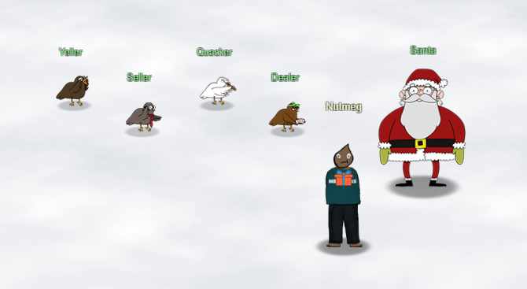

# Welcome to KringleCon 4: Calling Birds

## Introduction

Welcome reader, to my 2021 SANS Holiday Hack Challenge Solution Guide.  I'm Nutmeg, and this is my fourth year attending KringleCon.

First off I want to thank Ed Skoudis, the Counter Hack team, and all of the great KringleCon presenters.  As usual, this year's challenge was not only entertaining but also informative and educational, and skills that I learned while participating I feel will be directly relevant to my career as a CyberSecurity Professional.

I also want to thank my wife Kim, who once again put up with being a 'KringleCon Widow' for several weeks during the holiday season so I could indulge myself in this event.

Lastly, I'd like to recognize last year's Best Overall Runner Up, Neal Eikenberry (malcrypt), whose <a href="https://malcrypt.gitlab.io/hhc2020/">walkthrough</a> and markup source provided me with a great starting point and ideas for how to do my report this year.

## Report Format

Prior to this year I have submitted my reports as PDF documents written using Microsoft Word, and each year I conclude that I never want to do that to myself again. So this year I am following the practice of several winners from previous years and created this report using <a href="https://squidfunk.github.io/mkdocs-material/">Material for MkDocs</a>, hosted on GitHub Pages.

As a PDF it was easy to know how many pages previous submissions were, but as a web site this is harder to determine.  It's also more difficult as a web site (and in my opinion undesirable) to try to control things like font sizes, margins, page breaks, etc.

So in an effort to honor the spirit of the 50 page submission requirement as best I can this guide is broken into the following sections.

- Objectives: These are solutions to the main objectives and should be considered the primary content of this guide.  Additionally, information that is not directly related to the solution, such as elf / troll dialog, hints, and supporting screenshots are collapsed by default.
- Terminal Challenges: These are the elf / troll challenges that provide hints for the main objectives.  Links exist that cross reference them with their respective objectives, but the challenges themselves can be considered extra content.
- Extras: This is truly extra content that might be helpful or was just amusing enough that I thought should be documented.
- Not included: Other story / play-through elements, such as maps, dialog with Santa and other characters, the narrative and storyline, etc., are not part of this guide.  Honestly, these are things that I feel should be experienced by the player and is why I refer to this as a Solutions Guide rather than a Walkthrough.

My hope is that the above steps result in a guide that is is sufficiently detailed to help someone understand and complete the objectives, provides additional detail for those that want to dig deeper, and respects the time and efforts of the team that needs to read through and evaluate hundreds of submissions.

## Software and Tools

The main operating system used was Windows 11.  For some of the challenges where a Linux environment was more convenient (Objective 8 in particular) I used the new <a href="https://devblogs.microsoft.com/commandline/a-preview-of-wsl-in-the-microsoft-store-is-now-available/">Windows Subsystem for Linux preview</a> with an Ubuntu distro.

For Objective 12 I found it helpful to create a local version of the Frost Tower Website on a full Ubuntu virtual machine running in <a href="https://www.virtualbox.org/">VirtualBox</a>.

At some point or another I used the <a href="https://www.google.com/chrome/">Chrome</a>, <a href="https://www.mozilla.org/en-US/firefox/new/">Firefox</a>, and <a href="https://brave.com/">Brave</a> web browsers.

As mentioned earlier, this writeup was created using <a href="https://squidfunk.github.io/mkdocs-material/">Material for MkDocs</a>.

Screenshots were taken using <a href="https://getsharex.com/">ShareX</a>, and code editing was done with <a href="https://code.visualstudio.com/">Visual Studio Code</a>.

