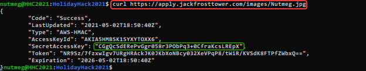

# Objective 10) How Hiring!

!!! summary "*Difficulty*: :fontawesome-solid-tree:{: style="color: red;"}:fontawesome-solid-tree:{: style="color: red;"}:fontawesome-solid-tree:{: style="color: red;"}:fontawesome-solid-tree:{: style="color: grey;"}:fontawesome-solid-tree:{: style="color: grey;"}"
    What is the secret access key for the <a href="https://apply.jackfrosttower.com/">Jack Frost Tower job applications server</a>? Brave the perils of Jack's bathroom to get hints from Noxious O'Dor.

## Hints and Resources

??? hint "Hints provided after helping Noxious O'Dor and completing the <a href="../../challenges/T10_IMDS_Exploration">IMDS Exploration</a> Terminal Challenge"
    **AWS IMDS Documentation** 
    The <a href="https://docs.aws.amazon.com/AWSEC2/latest/UserGuide/instancedata-data-retrieval.html">AWS documentation for IMDS</a> is interesting reading. 

??? hint "Other statements made by Noxious O'Dor after completing the IMDS Exploration challenge"
    "I'm very concerned about the combination of SSRF and IMDS access." 
    "Dr. Petabyte told us, "anytime you see URL as an input, test for SSRF." 
    "With an SSRF attack, we can make the server request a URL. This can reveal valuable data!"

## Solution

Exploring the web site <a href="https://apply.jackfrosttower.com/">https://apply.jackfrosttower.com/</a> we find that the "Apply" page gives us a way to supply user input, and one of the fields is intended to be the URL to our *Naughty List Background Investigation* report.

Cloud resources can sometimes have access to their Cloud Service Provider's Instance Metadata Service (IMDS) using the non-routable IP address 169.254.169.254.  If the server processing the web form does not have protections against Server Side Request Forgery, then we may be able to use this field to get the server to reveal IMDS information.

So the first logical thing to try is to just put the IMDS url http://169.254.169.254 in to the field and see what happens.

??? info "Screenshot"
    

The result is a 'Submission Accepted' page.  In the middle of the page is what looks like a broken link, which if we inspect we see goes to 'https://apply.jackfrosttower.com/images/Nutmeg.jpg'.

??? info "Screenshot"
    

Suspecting that this isn't actually a JPG file we can use a tool like cURL to retrieve the raw contents of the file instead.  Doing so we learn that it contains the output that we could expect from the cloud IMDS service.

So the URL we are entering in the form is being evaluated by the server and is able to access IMDS.  Now we just need to compose the IMDS request that will give us the access key.  

First we need to get the identity and access roles, which we learned in the IMDS Exploration tutorial is the URL 
`http://169.254.169.254/latest/meta-data/iam/security-credentials`

We enter that into the Apply page URL field, submit again, then use cURL as before to read the results.

Now we know there is a single IAM role, jf-deploy-role, so we repeat the process to retrieve the Access Key for this role. 
`http://169.254.169.254/latest/meta-data/iam/security-credentials/jf-deploy-role`

## Completion

!!! success "Answer"
    CGgQcSdERePvGgr058r3PObPq3+0CfraKcsLREpX