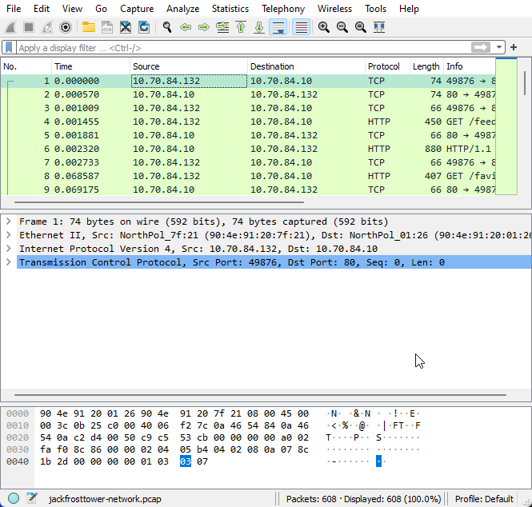
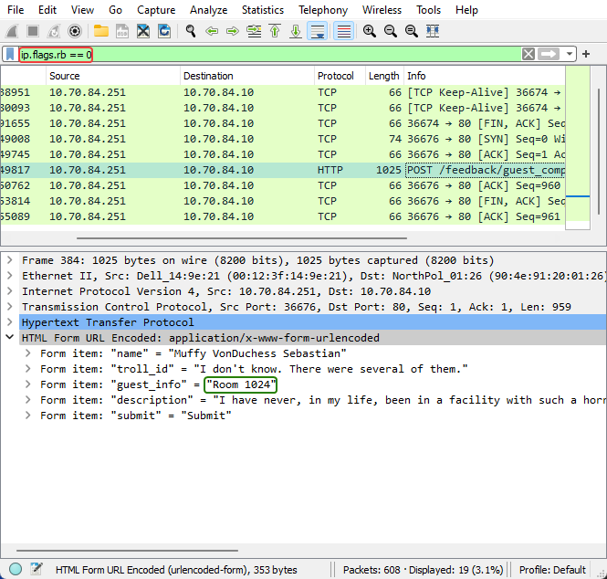
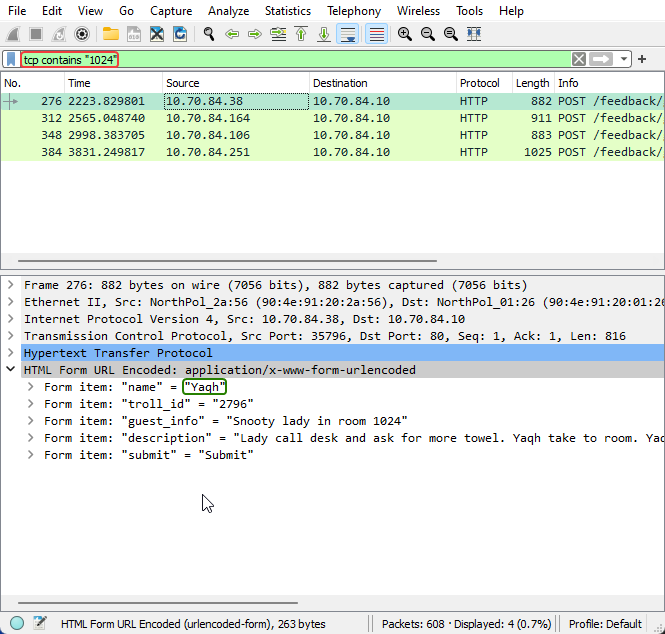
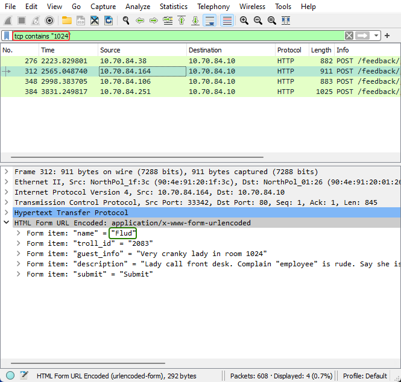
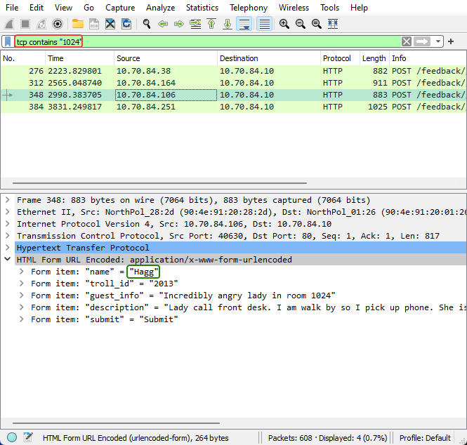

# Objective 11) Customer Complaint Analysis

!!! summary "*Difficulty*: :fontawesome-solid-tree:{: style="color: red;"}:fontawesome-solid-tree:{: style="color: red;"}:fontawesome-solid-tree:{: style="color: grey;"}:fontawesome-solid-tree:{: style="color: grey;"}:fontawesome-solid-tree:{: style="color: grey;"}"
    A human has accessed the Jack Frost Tower network with a non-compliant host. <a href="https://downloads.holidayhackchallenge.com/2021/jackfrosttower-network.zip">Which three trolls complained about the human</a>? Enter the troll names in alphabetical order separated by spaces. Talk to Tinsel Upatree in the kitchen for hints.
 

## Hints and Resources

??? hint "Hints provided after helping Tinsel Upatree and completing the <a href="../../challenges/T11_Strace_Ltrace_Retrace">Strace, Ltrace, Retrace</a> Terminal Challenge"
    **Evil Bit RFC** 
    <a href="https://datatracker.ietf.org/doc/html/rfc3514">RFC3514</a> defines the usage of the "Evil Bit" in IPv4 headers. 
     
    **Wireshark Display Filters** 
    Different from BPF capture filters, Wireshark's <a href="https://wiki.wireshark.org/DisplayFilters">display filters</a> can find text with the `contains` keyword - and evil bits with `ip.flags.rb`. 

??? hint "Other Resources"
    **Wireshark** 
    <a href="https://wireshark.org/#download">https://wireshark.org/#download</a>

    **KringleCon Talk** 
    <a href="http://www.youtube.com/watch?v=ermEx0UvcqY">RFC-3514 Compliant Pentesting: Being Good While You're Being Bad</a> - Tom Liston

## Troll Introduction

??? quote "Talk to Pat Tronizer in the Frost Fest Talks Lobby"
    Hrmph. Oh hey, I'm Pat Tronizer. 
    I'm SO glad to have all these first-rate talks here. 
    We issued a Call for Talks, but only one person responded… We put him in track 1. 
    But Jack came up with an ingenious way to borrow additional talks for FrostFest! You can hardly tell where we got these great speakers! 
    Anyway, I cannot believe an actual human <a href="https://downloads.jackfrosttower.com/2021/jackfrosttower-network.zip">connected to the Tower network</a>. It’s supposed to be the domain of us trolls and of course Jack Frost himself. 
    Mr. Frost has a strict policy: all devices must be <a href="https://datatracker.ietf.org/doc/html/rfc3514">RFC3514</a> compliant. It fits in with our nefarious plans. 
    Some human had the nerve to use our complaint website to submit a complaint! 
    That website is for trolls to complain about guests, NOT the other way around. 
    Humans have some nerve.

## Setup

Download and install Wireshark on your device if it isn't already (default options should be fine).

## Solution

Download the zip file linked to in the objective description or Pat's introduction.  Unzip it to get the jackfrosttower-network.pcap file and open it with Wireshark.
??? info "Screenshot"
    

Apply the filter `ip.flags.rb == 0` to show only those packets that don't have the "Evil Bit" set.  In other words, the non-Troll data.

Looking at the results we find one packet that is an HTTP POST.  Select it and expand the HTML Form in the Packet Details to read the details of the complaint submission.
??? info "Screenshot"
    

In the guest_info form item we see that the human, Muffy VonDuchess Sebastian, was residing in room 1024.  We now apply the filter `tcp contains "1024"` to get any packets referencing that room. 

This results in 4 POST requests, which we can look at in turn to find the names of the 3 trolls that complained about Muffy.
??? info "Screenshots"
    
    
    

## Completion

!!! success "Answer"
    Flud Hagg Yaqh

## Extra

To see all the customer complaint submissions, see <a href="../../extras/O11_Customer_Complaint_Analysis">this table</a> in the Extras section.