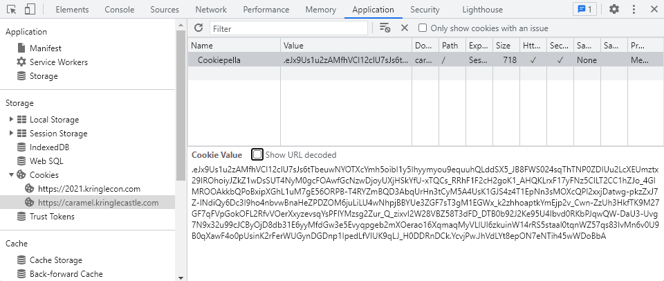

# Objective 2) Where in the World is Caramel Santaigo

!!! summary "*Difficulty*: :fontawesome-solid-tree:{: style="color: red;"}:fontawesome-solid-tree:{: style="color: grey;"}:fontawesome-solid-tree:{: style="color: grey;"}:fontawesome-solid-tree:{: style="color: grey;"}:fontawesome-solid-tree:{: style="color: grey;"}"
    Help Tangle Coalbox find a wayward elf in Santa's courtyard. Talk to Piney Sappington nearby for hints.

## Hints and Resources

??? hint "Hints provided after talking to Piney Sappington and completing the <a href="../../challenges/T2_Document_Analysis">Document Analysis / Exif Metadata</a> Terminal Challenge"
    **Coordinate Systems** 
    Don't forget coordinate systems other than lat/long like <a href="https://en.wikipedia.org/wiki/Military_Grid_Reference_System">MGRS</a> and <a href="https://what3words.com/">what3words</a>. 
     
    **Flask Cookies** 
    While Flask cookies can't generally be forged without the secret, they can often be <a href="https://gist.github.com/chriselgee/b9f1861dd9b99a8c1ed30066b25ff80b">decoded and read</a>. 
     
    **OSINT Talk** 
    Clay Moody is giving <a href="https://www.youtube.com/watch?v=tAot_mcBT9c">a talk</a> about OSINT techniques right now!

??? hint "Other Resources"
    **Cyber Chef** 
    <a href="https://gchq.github.io/CyberChef/">https://gchq.github.io/CyberChef/</a>

## Elf Introduction

??? quote "Talk to Tangle Coalbox in Santa's Courtyard"
    Hey there, Gumshoe. Tangle Coalbox here again. 
    I've got a real doozy of a case for you this year. 
    Turns out some elves have gone on some misdirected journeys around the globe. It seems that someone is messing with their travel plans. 
    We could sure use your open source intelligence (OSINT) skills to find them. 
    Why dontcha' log into this vintage Cranberry Pi terminal and see if you have what it takes to track them around the globe. 
    If you're having any trouble with it, you might ask Piney Sappington right over there for tips.

## Solution

Start the game by clicking on the terminal next to Tangle Coalbox. 
You have two options for solving this objective.  The first is to play the game as intended (the Nice way).  The second is to hack the game (the Naughty way).

=== "Nice"
    Play the game by using the three Investigate options at each location to determine the next location as well as attributes about the Elf you are following.

    Investigation options 1 and 2 will provide you with clues about the next location.  Investigate option 3 will provide you with the temperature of the next locatin as well as some of the characteristics of the Elf which can be used with InterRink to narrow down which Elf it is.

    When you have reached the third location, identfy the elf to win the game.

    If you want to be only slightly naughty, <a href="../../extras/O2_Where_in_the_World_is_Caramel_Santaigo/">this table</a> in the Extras section lists all the location hints and where they lead to.

=== "Naughty"
    The other way to win is to start the game with Web Developer tools enabled (for Google Chrome, go to Menu > More tools > Developer tools).

    After the game is started go to the Application section and on the left drill down to Storage > Cookies > htttps//caramel.kringlecastle.com.  There you will find a cookie named 'Cookiepella'.
    ??? note "Screenshot"
        

    Copy the value of that cookie into Cyber Chef, then use the recipies `From Base64 (Alphabet: URL Safe)` followed by `Zlib Inflate` to decode the cookie (Click <a href="https://gchq.github.io/CyberChef/#recipe=From_Base64('A-Za-z0-9-_',true)Zlib_Inflate(0,0,'Adaptive',false,false)&input=LmVKeDlVczF1MnpBTWZoVkNsMTJjSVU3c0pzNnRUYmV1d05ZT1RYY1ltaDVvaWJJMXk1SWh5eW15b3U5ZXF1dWhRTGRkU1g1X0pCOEZXUzAyNHNxVGhUTlAwWkRJVXUyTGNYRVVtenR4MjlJUk9ob2l5SlprWjF3RHNTVVQ0TnlNMGdjRk9Bd2ZHY056d0Rqb3lVWGpIU2tZZlUteFRRQ3NfUlJoRjFGMmNIMmdvSzFfQUhRS0xyeEYxN3lGTno1Q0lMVDJDQzFoWkpvXzRHbE1ST09Ba2tiUVBvQnhpcFhHaEwxdU03Z0U1Nk9SUEItVDRSWVptQlFEM0FicVVySG4zdEN5TTVBNFVzSzFHSlM0ejRUMUVwTm4zc01PWGNRUEkyeHhqRGF0d2ctcGt6WnhKN1otSU5kaVF5NkRjM0k5aG80bmJ2d0JuYUhlWlBEWk9NNmp1TGlMVTR3TmhwakJCWVVlM1pHRjdzVDNnTTFFR1d4X2syemhob2FwdGtZbUVqcDJ2X0N3bi1aelVoM0hrZlRLOU0yN0dGN3FGVnBHb2tPRkwyUmZ2Vk9lclh4eXpldnNxWXNQRklZTXpzZzJadXJfUV96aXh2STJXMjhWQlo1OFQzZEZEX0RUQjBiOTJKMktlOTVVNElidmQwUktiUEpxd1FXLURhVTMtVXZnN045eDMydTk5Y0pDQnlPakQ4ZGIzMUU2eXlNZmRHdzNlNUV2eXFwZ2ViMm1YT2VyYW8xNlhxbWFxTXlWTGxVbDZ6a3VpblcxNHJSUzVzdGFhbDB0cW5XWjU3cXM4M0l2TW42djBVOUIwcVhhd0Y0bzBwVXNpbksyckZlcldVR3luREdEbnAxSXBlZExmVklVSzlxTEpfSDBERFJuRENrLlljdmpQdy5KaFZkTFl0OGVwT043ZU5UaWg0NXdXRG9CYkE">here</a> for an example) 

    Note the values of the "elf" and "route" attributes (in this example, "Noel Boetie" and "Stuttgart, Germany","Prague, Czech Republic","London, England"), which will provide you with the name of the elf along with the route to take without having to perform a single investigation.

## Completion

Winning the game by either method will mark the objective as complete in your badge.

??? quote "Tangle Coalbox"
    You never cease to amaze, Kid. Thanks for your help.