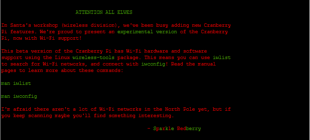
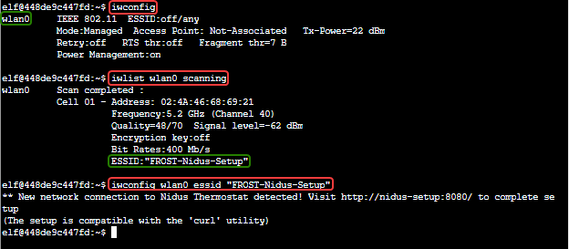
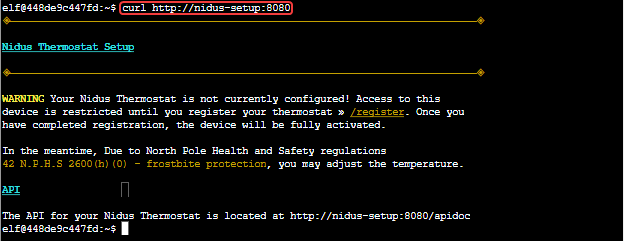
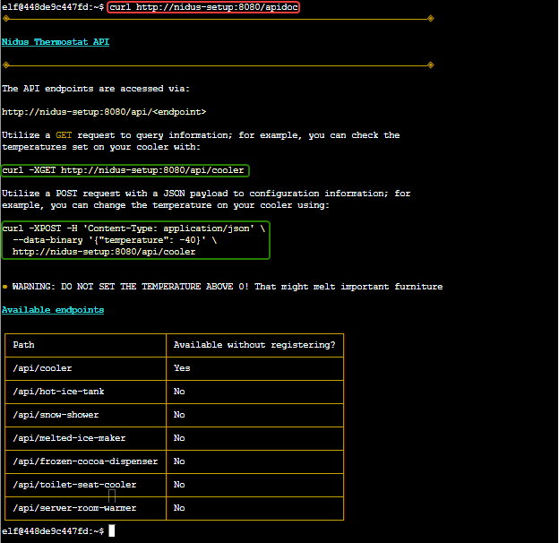
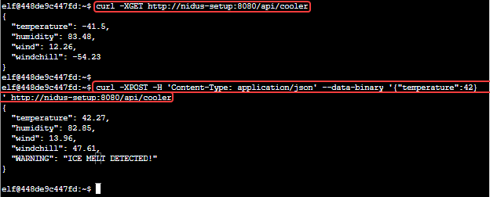

# Objective 3) Thaw Frost Tower's Entrance

!!! summary "*Difficulty*: :fontawesome-solid-tree:{: style="color: red;"}:fontawesome-solid-tree:{: style="color: red;"}:fontawesome-solid-tree:{: style="color: grey;"}:fontawesome-solid-tree:{: style="color: grey;"}:fontawesome-solid-tree:{: style="color: grey;"}"
    Turn up the heat to defrost the entrance to Frost Tower. Click on the <a href="https://2021.kringlecon.com/badge?section=item">Items</a> tab in your badge to find a link to the Wifi Dongle's CLI interface. Talk to Greasy Gopherguts outside the tower for tips.
 

## Hints and Resources

??? hint "Hints provided after helping Greasy GopherGuts and completing the <a href="../../challenges/T3_Grepping_for_Gold">Grepping for Gold</a> Terminal Challenge"
    **Linux Wi-Fi Commands** 
    The <a href="https://linux.die.net/man/8/iwlist">iwlist</a> and <a href="https://linux.die.net/man/8/iwconfig">iwconfig</a> utilities are key for managing Wi-Fi from the Linux command line. 
     
    **Web Browsing with cURL** 
    <a href="https://linux.die.net/man/1/curl">cURL</a> makes HTTP requests from a terminal - in Mac, Linux, and modern Windows! 
     
    **Adding Data to cURL Requests** 
    When sending a <a href="https://www.educative.io/edpresso/how-to-perform-a-post-request-using-curl">POST request with data</a>, add `--data-binary` to your `curl` command followed by the data you want to send. 

## Troll Introduction

??? quote "Talk to Grimy McTrollkins outside of the Frost Tower"
    Yo, I'm Grimy McTrollkins. 
    I'm a troll and I work for the big guy over there: Jack Frost. 
    I’d rather not be bothered talking with you, but I’m kind of in a bind and need your help. 
    Jack Frost is so obsessed with icy cold that he accidentally froze shut the door to Frost Tower! 
    I wonder if you can help me get back in. 
    I think we can melt the door open if we can just get access to the thermostat inside the building. 
    That thermostat uses Wi-Fi. And I’ll bet you picked up a Wi-Fi adapter for your badge when you got to the North Pole. 
    Click on your badge and go to the Items tab. There, you should see your Wi-Fi Dongle and a button to “Open Wi-Fi CLI.” That’ll give you command-line interface access to your badge’s wireless capabilities. 

## Solution

Open the WiFi Dongle in the Items section in your badge while standing near the Frost Tower entrance.
??? info "Screenshot"
    

The first step is to get connected via WiFi to the thermostat.  First we should determine what our local WiFi adapter is with 
`iwconfig`

Then, look for any local WiFi networks with 
`iwlist wlan0 scanning`.  

This tells us that the name of the nearby WiFi network is FROST-Nidus-Setup.  Connect to it with 
`iwconfig wlan0 essid "FROST-Nidus-Setup"`
??? info "Screenshot"
    

After connecting to the FROST-Nidus-Setup network we recived a message that we should go to http://nidus-setup:8080/ to complete setup. 
`curl http://nidus-setup:8080`
??? info "Screenshot"
    

That page gives us the path to the API documentation 
`curl http://nidus-setup:8080/apidoc/`
??? info "Screenshot"
    

From the API documentation we learn that the command to set the temperature is 
`curl -XPOST -H 'Content-Type: application/json' --data-binary '{"temperature":42}' http://nidus-setup:8080/api/cooler`
??? info "Screenshot"
    

## Completion

Setting the temperature to any value above 0 completes the challenge.

??? quote "Grimy McTrollkins"
    Great - now I can get back in!