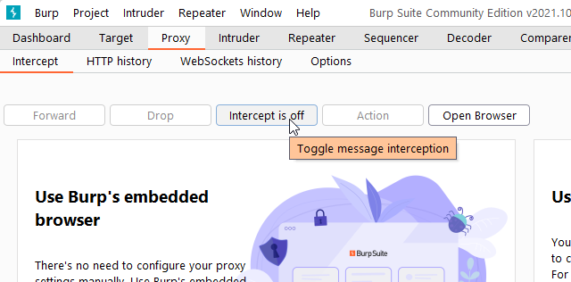
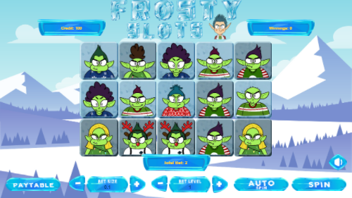
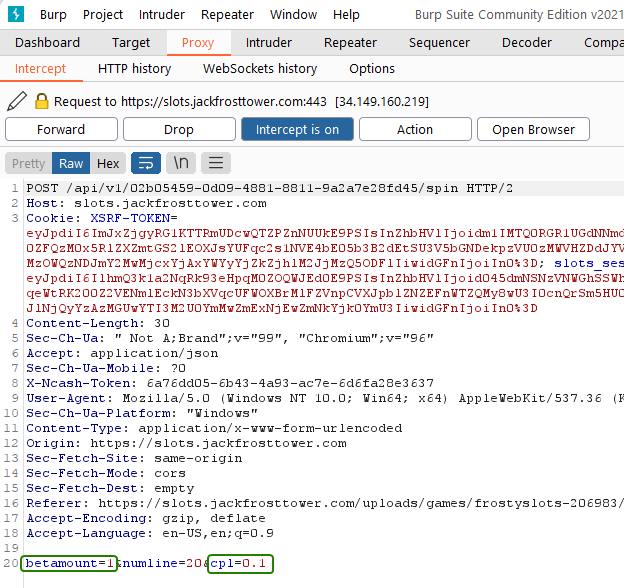
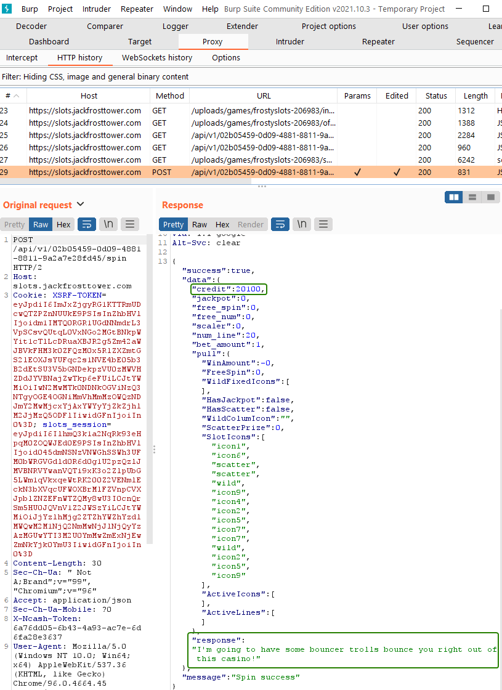
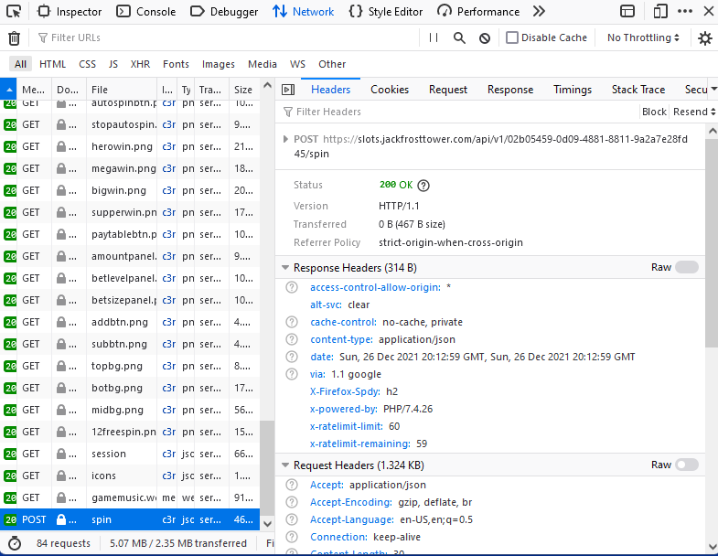
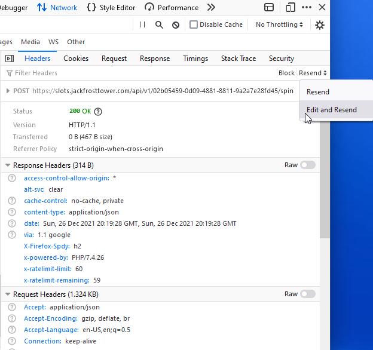
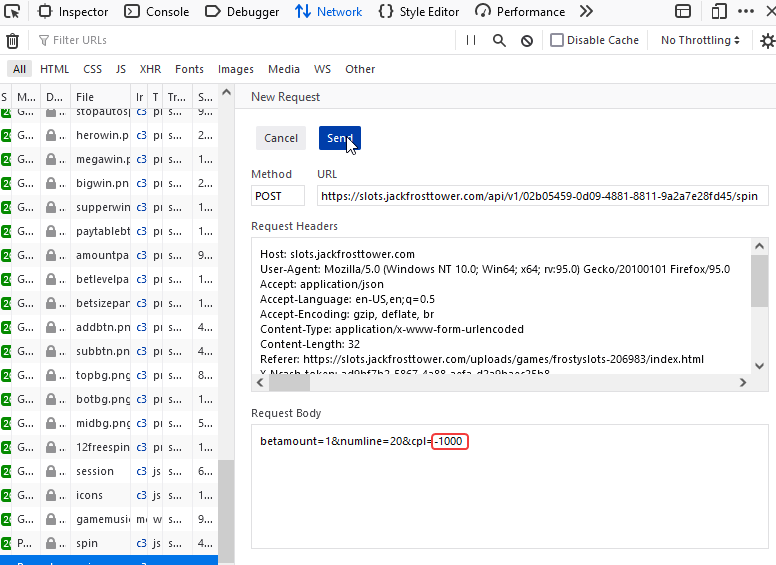
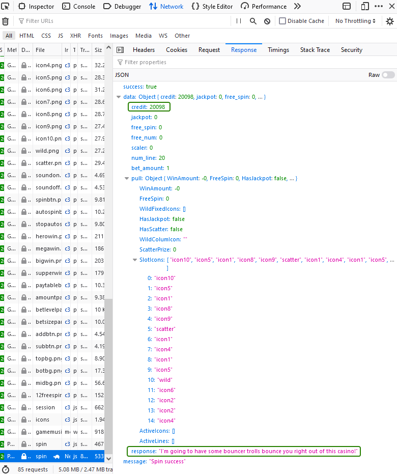

# Objective 4) Slot Machine Investigation

!!! summary "*Difficulty*: :fontawesome-solid-tree:{: style="color: red;"}:fontawesome-solid-tree:{: style="color: red;"}:fontawesome-solid-tree:{: style="color: grey;"}:fontawesome-solid-tree:{: style="color: grey;"}:fontawesome-solid-tree:{: style="color: grey;"}"
    Test the security of Jack Frost's <a href="https://slots.jackfrosttower.com/">slot machines</a>. What does the Jack Frost Tower casino security team threaten to do when your coin total exceeds 1000? Submit the string in the server data.response element. Talk to Noel Boetie outside Santa's Castle for help.

## Hints and Resources

??? hint "Hints provided after helping Noel Boetie and completing the <a href="../../challenges/T4_Logic_Munchers">Logic Munchers</a> Terminal Challenge"
    **Parameter Tampering** 
    It seems they're susceptible to <a href="https://owasp.org/www-community/attacks/Web_Parameter_Tampering">parameter tampering</a>. 
     
    **Intercepting Proxies** 
    Web application testers can use tools like <a href="https://portswigger.net/burp/communitydownload">Burp Suite</a> or even right in the browser with Firefox's <a href="https://itectec.com/superuser/how-to-edit-parameters-sent-through-a-form-on-the-firebug-console/">Edit and Resend</a> feature. 

## Troll Introduction

??? quote "Talk to Hubrus Selfington in the Frost Tower Lobby"
    Snarf. Hrung. Phlthth. 
    I'm Hubris Selfington. 
    The big boss told me he’s worried about vulnerabilities in his slot machines, especially this one. 
    Statistically speaking, it seems to be paying out way too much. 
    He asked me to see if there are any security flaws in it. 
    The boss has HUGE plans and we’ve gotta make sure we are running a tight ship here at Frost Tower. 
    Can you help me find the issue? 
    I mean, I could TOTALLY do this on my own, but I want to give you a chance first.

## Solution

Click on one of the slot machines in the Frost Tower Lobby, or go to the direct link: <a href="https://slots.jackfrosttower.com">https://slots.jackfrosttower.com</a>

Playing the game we find that we can set a 'Bet Size' to a value of either .1, .25, or .5, and a 'Bet Level' to a value between 1 and 10.  This results in a 'Bet Amount' using the calculation 
`(Bet_Size * 20) * Bet_Level = Bet_Amount`

The hints for this objective indicate that there is likely some parameter being passed between the web client and server that we can manipulate, and two possible methods of doing so.

Both methods involve capturing the web request that initiates the 'spin' of the slot machine.  This request includes two parameters, betamount which equals the Bet Level, and cpl which equals the Bet Size.

By changing these values we can modify the total bet sent to the server.  One option would be to make the bet a very large amount, which if the spin was a winner would get us our balance of greater than 1000 in one go.  However, the way more likely to succeed is to change our bet to a very large negative number, which will be subtracted (and therefore added) if we loose.  This can be done by setting cpl to a large negative number.

*Incidentally, if you try to change the betamount value to a negative number it will result in an error that betamount must be greater or equal to zero, so the coding of the slot machine isn't completely broken*.

The reply to this modified 'spin' will include our new balance along with the message from the tower security team that is to be submitted as the challenge answer.

=== "Burp Suite Method"

    Start Burp Suite and start a new project using Burp Defaults.

    To go the Proxy tab and turn off Intercept, then open the built in browser and go to <a href="https://slots.jackfrosttwer.com">https://slots.jackfrosttoer.com</a>
    ??? note "Screenshot"
        

    Start a new game and get to where you can spin the wheel.
    ??? note "Screenshot"
        

    Turn Intecept on in Burp Suite and then spin.

    In Burp Suite you will see the intercepted packet with the betamount and cpl values.
    ??? note "Screenshot"
        

    Edit the cpl value to be `-1000`, then turn Intercept off.  This will forwared the modified packet and recieve the response, which can be seen in the HTTP History.
    ??? note "Screenshot"
        

=== "FireFox Method"

    Start Firefox and open Developer Tools (Menu > More tools > Web Developer Tools)

    Go to <a href="https://slots.jackfrosttower.com">https://slots.jackfrosttower.com</a> and start a game.

    Spin the wheel and then find the POST request for the 'spin' file in the Network history (it will likely be the last one in the list)
    ??? note "Screenshot"
        

    Select `Edit and Resend` from the drop down in the top right of the window.
    ??? note "Screenshot"
        

    On the 'New Request' page, modify the Request body to change the cpl value then click `Send`.
    ??? note "Screenshot"
        

    Select the modified 'spin' request and view the Response.
    ??? note "Screenshot"
        

    
## Completion

!!! success "Answer"
    I'm going to have some bouncer trolls bounce you right out of this casino!

??? quote "Hubrus Selfington"
    Yeah, that's exactly how I would have solved it, but thanks.