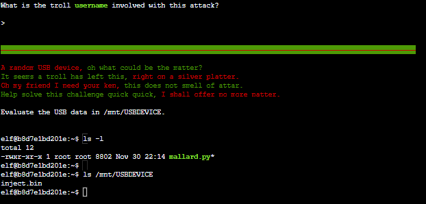
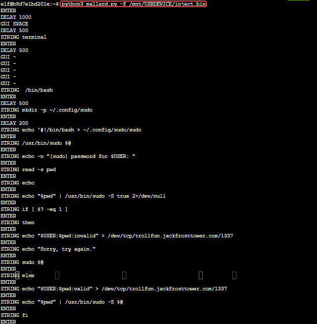
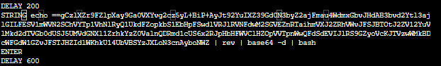
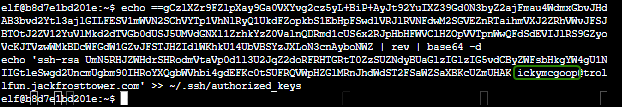

# Objective 5) Strange USB Device

!!! summary "*Difficulty*: :fontawesome-solid-tree:{: style="color: red;"}:fontawesome-solid-tree:{: style="color: red;"}:fontawesome-solid-tree:{: style="color: grey;"}:fontawesome-solid-tree:{: style="color: grey;"}:fontawesome-solid-tree:{: style="color: grey;"}"
    Assist the elves in reverse engineering the strange USB device. Visit Santa's Talks Floor and hit up Jewel Loggins for advice.

## Hints and Resources

??? hint "Hints provided after helping Jewel Loggins and completing the <a href="../../challenges/T5_IPv6_Sandbox">IPv6 Sandbox</a> Terminal Challenge"
    **Ducky Script** 
    <a href="https://docs.hak5.org/hc/en-us/articles/360010555153-Ducky-Script-the-USB-Rubber-Ducky-language">Ducky Script</a> is the language for the USB Rubber Ducky 
     
    **Duck Encoder** 
    Attackers can encode Ducky Script using a <a href="https://docs.hak5.org/hc/en-us/articles/360010471234-Writing-your-first-USB-Rubber-Ducky-Payload">duck encoder</a> for delivery as `inject.bin`. 
     
    **Ducky RE with Mallard** 
    It's also possible the reverse engineer encoded Ducky Script using <a href="https://github.com/dagonis/Mallard">Mallard</a> 
     
    **Mitre ATT&CK and Duckyr** 
    The <a href="https://attack.mitre.org/techniques/T1098/004/">MITRE ATT&CK™ tactic T1098.004</a> describes SSH persistence techniques through authorized keys files. 

??? hint "Other Resources"
    **KringleCon Talk** 
    <a href="http://www.youtube.com/watch?v=tkAYncGF-zw">HIDden Ducky, Deconstructed Payload</a> - Kevin Tyers

## Elf Introduction 

??? quote "Talk to Morcel Nougat in the Speaker UNPreparation Room"
    Hello and welcome to the speaker _Un_Preparedness Room! 
    I'm Morcel Nougat, elf extraordinaire. 
    I've heard the talks at the other con across the way are a bit... off. 
    I really don't think they have the right sense about what makes for a wonderful holiday season. But, anyway! 
    Say, do you know anything about USB Rubber Duckies? 
    I've been playing around with them a bit myself. 
    Please see what you can do to help solve the Rubber Ducky Objective! 
    Oh, and if you need help, I hear Jewel Loggins, on this floor outside this room, has some experience.

## Solution

When we open the Strange USB Device terminal we find that the mallard.py python script is located in our home directory and that the USB device contains a single file named inject.bin.
??? note "Screenshot"
    

Run Mallard against the suspected malicious binary. 
`python3 mallard.py -f /mnt/USBDEVICE/inject.bin`
??? note "Screenshot"
    

This provides us with the contents of inject.bin, which is a series of commands that attempts to coerce the victim who pugged the device in into entering their username and password which is then transmitted to trollfun.jackfrosttower.com:1337.  

The most interesting command however is near the bottom, and includes a base64 encoded string.

This command takes the string, reverses it, decodes that, and pipes the result into bash to execute it.  Decoding the command could be done with a tool like <a href="https://gchq.github.io/CyberChef/">Cyber Chef</a>, but in this case it's easier to just run the command while leaving off the part that pipes it into bash.

!!! warning
    If you are engaged in a real malware investigation, **always** perform actions like this in a sandbox environment unless you are **absolutely certain** that you understand what any commands are doing and that you will not inadvertently run malicious code somewhere that you don't want to.  See the great KringleCon talk, <a href="http://www.youtube.com/watch?v=ifX8Pcrr7g0">How to Build a Free Malware Lab in Under an Hour</a> by Mary Ellen Kennel for some ideas on how to build such an environment.

Decoding the command that is meant to be executed by bash we see that it adds an SSH key for the user `ickymcgoop@trollfun.jackfrosttower.com` to the local key file, granting the attacker persistent access to this system.
??? note "Screenshot"
    

## Completion

!!! success "Answer"
    ickymcgoop

??? quote "Morcel Nougat"
    Yay! Fantastic work!